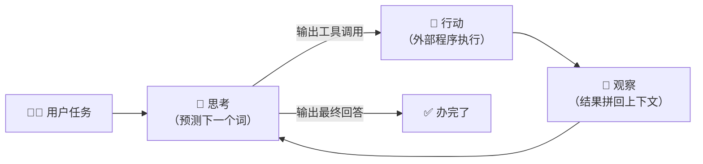

# A0 · 小结与自测

## 一图回顾

一句话收束：**智能体 = 大模型 + 工具 + 循环**。模型每一拍做的仍是「预测下一个词」，新增的只有「输出可以是工具调用」和「结果回填形成循环」两件事。而是否值得开启这个循环，取决于任务在自主性光谱上的位置——流程画得出来用工作流，路径要现编才上智能体。

## 要点回顾

| 小节 | 两行版 |
| --- | --- |
| [A0.1 智能体的心跳](./01-what-is-agent.mdx) | 思考→行动→观察循环到办完为止；能力与风险一起翻倍：说错话变成做错事，错误还会滚雪球 |
| [A0.2 自主性光谱](./02-autonomy-spectrum.mdx) | 单次调用→工作流→带工具对话→智能体，分界看「下一步谁定」；自主性的价格是可预测性、成本与可调试性 |

## 综合自测

<Quiz questions={[
  {
    q: '智能体循环的一次完整心跳，正确的顺序是？',
    options: [
      '行动 → 思考 → 观察',
      '思考 → 行动 → 观察',
      '观察 → 回答 → 思考',
      '规划 → 记忆 → 输出',
    ],
    answer: 1,
    explanation: '先想（决定下一步）、再做（调工具）、后看（结果拼回上下文），然后回到「想」。顺序错了循环就转不起来。',
  },
  {
    q: '智能体「思考」这一步的本质是什么？',
    options: [
      '一种全新的推理引擎',
      '规则引擎在匹配条件',
      '大模型在做「预测下一个词」，与上篇讲的生成机制完全相同',
      '在数据库里检索答案',
    ],
    answer: 2,
    explanation: '没有新引擎。智能体的思考、乃至生成工具调用请求本身，都是同一个自回归生成过程——这是理解下篇一切内容的锚点。',
  },
  {
    q: '同一个智能体、同一个任务，跑两遍得到了两条不同的轨迹。最合理的解释是？',
    options: [
      '程序有 bug',
      '每一步生成都是从概率分布中采样的，路径天然有随机性',
      '工具返回了错误结果',
      '模型在两次之间被重新训练了',
    ],
    answer: 1,
    explanation: '3.6 节的老朋友：生成即采样。多步循环把单步的随机性放大成路径的分岔——这不是 bug，但它决定了智能体必须用统计方法评测（A7 章）。',
  },
  {
    q: '「用户提交退款申请 → 提取订单号 → 查订单状态 → 按规则批准或转人工」，这个系统最适合做成？',
    options: [
      '完全自主的智能体，让模型自己决定流程',
      '工作流：步骤写死，各步由模型/工具填充',
      '纯单次调用',
      '多智能体辩论系统',
    ],
    answer: 1,
    explanation: '流程完全画得出来，而且涉及退款这种「错不起」的操作——写死步骤既便宜又可审计。把它做成自主智能体是在为用不到的灵活性支付可预测性。',
  },
  {
    q: '给智能体设「最大步数上限」这类围栏，主要是为了防什么？',
    options: [
      '防止模型学到坏习惯',
      '防止死循环和失控的开销——模型可能反复执行同样的无效动作',
      '防止用户提太多要求',
      '让答案更准确',
    ],
    answer: 1,
    explanation: '循环的出口之一是「模型认为办完了」，但它可能永远到不了这个状态（比如反复查同一个东西）。外部上限是必备的兜底，与准确性无关。',
  },
  {
    q: '关于自主性与围栏的关系，业界的标准做法是？',
    options: [
      '自主性越高，围栏越可以放松',
      '自主性和围栏无关',
      '放开自主性的同时收紧围栏：权限分级、高危动作人工确认、沙箱执行',
      '有了围栏就不需要评测了',
    ],
    answer: 2,
    explanation: '自主性和约束是成对调节的旋钮：给模型更多决定权的同时，要用白名单、审批和沙箱把「错得起的范围」圈出来。围栏管的是损失上限，评测（A7）管的是成功概率，两者都不可少。',
  },
]} />

下一章 [A1 · 工具调用](../01-tool-use/index.md)：把「行动」这一拍拆到底——模型是怎么读说明书、填参数、拿结果的。
