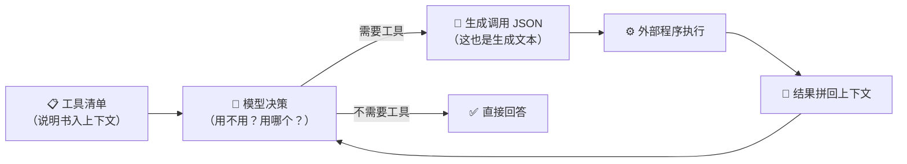

# A1 · 小结与自测

## 一图回顾

一句话收束：**模型没有手——「调用工具」是生成一段结构化文本，执行权在外部程序**；而读懂说明书、递对纸条、判断该不该伸手，这整套本事是预训练、SFT 和 RL 一层层喂出来的。

## 要点回顾

| 小节 | 两行版 |
| --- | --- |
| [A1.1 Function Calling 全流程](./01-function-calling.mdx) | 上清单→做决策→递纸条→外部执行→结果回填五步接力；描述即接口，说明书的质量决定调用的对错 |
| [A1.2 会用工具是训练出来的](./02-how-models-learn-tools.mdx) | 预训练「见过」、SFT「会写」、RL「会判断」；「不伸手」也要专门训练，直觉的可靠性要靠评测兜底 |

## 综合自测

<Quiz questions={[
  {
    q: '工具调用流程中，真正「执行」工具的是谁？',
    options: [
      '模型内部的执行引擎',
      '模型上下文里的说明书',
      '模型之外的普通程序——模型只负责生成调用请求',
      '云端的另一个更大的模型',
    ],
    answer: 2,
    explanation: '模型自始至终只生成文本。把「生成调用请求」和「执行调用」分开，是理解工具调用安全边界和错误处理的前提——纸条写错了可以纠正，但执行出去的动作可能收不回来。',
  },
  {
    q: '「描述即接口」的准确含义是？',
    options: [
      '工具描述会被编译成接口代码',
      '模型只能通过描述认识工具——描述写成什么样，工具在模型眼里就是什么样',
      '接口文档必须用英文写',
      '描述越长，模型越容易选对',
    ],
    answer: 1,
    explanation: '模型看不到工具的实现，只看得到那句描述。实验里把「按实时汇率换算」改成「处理数字」，工具就在模型的认知里「消失」了。「越长越好」也不对——冗长含糊的描述同样害人，关键是准确说清能干什么。',
  },
  {
    q: '用户说「你好呀」，模型没有调用任何工具、直接回应了。对这个行为最准确的评价是？',
    options: [
      '模型偷懒了，应该至少搜索一下',
      '这是正确决策——判断「不需要工具」和选对工具同样是能力',
      '这是随机行为，下次可能就去调用了',
      '说明这个模型不支持工具调用',
    ],
    answer: 1,
    explanation: '寒暄不缺任何外部信息，调用只会白花延迟和 token。克制的「不伸手」是训练出来的能力（靠反例示范），过度调用反而是要治的病。',
  },
  {
    q: '把「预训练 / SFT / RL」对应到工具能力的三层来源，正确的是？',
    options: [
      '预训练教格式，SFT 埋底子，RL 教判断',
      '预训练埋底子（见过代码与 API 文档），SFT 教格式（示范轨迹），RL 精修判断（可验证奖励）',
      '三者作用完全相同，只是算力不同',
      '工具能力只来自 RL，与前两层无关',
    ],
    answer: 1,
    explanation: '三层各管一段：见过（认识这种文体）→ 会写（格式规矩）→ 会判断（该不该用、用哪个）。少了任何一层，工具调用都会以对应的方式露怯。',
  },
  {
    q: '训练数据里的 tool_result 内容不参与损失计算，这个设计防的是什么？',
    options: [
      '防止训练太慢',
      '防止模型学会「编造工具返回结果」——环境产生的内容不该由模型学着说',
      '防止工具泄露隐私',
      '防止上下文超长',
    ],
    answer: 1,
    explanation: '这是 loss mask 在工具场景的迁移：让模型去预测天气 API 的返回值，等于训练它凭空捏造像模像样的数据。只对模型自己该生成的部分算损失，幻觉才不会被写进训练目标。',
  },
  {
    q: '一个智能体在简单任务上频繁进行不必要的工具调用，最直接的代价是什么？',
    options: [
      '模型参数会变多',
      '每次多余调用都白花延迟和 token，任务又慢又贵',
      '工具会被用坏',
      '上下文会被清空',
    ],
    answer: 1,
    explanation: '行动循环每多转一圈就是一次完整的模型调用加一次工具执行。过度调用不影响参数也不清空上下文，但它把 A0 章说的「循环的成本」白白翻了几倍——这正是要用反例数据治它的原因。',
  },
]} />

下一章 [A2 · 规划与反思](../02-planning-reflection/index.md)：手已经有了，接下来给智能体装上「先拆事、后检查」的脑回路。
