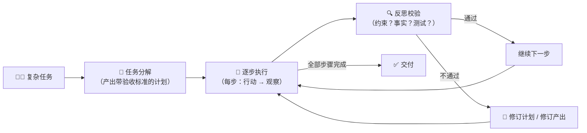

# A2 · 小结与自测

## 一图回顾

一句话收束：**规划管「别跑偏」，反思管「别带病交付」**——前者在动手前把大事拆成可验收的小步，后者在每步之后拿证据回头对账。两者都不是免费的：从一把梭的 800 token 到全程反思的 4200 token，可靠性是拿 token 和时间买的，按任务风险决定买多少。

## 要点回顾

| 小节 | 两行版 |
| --- | --- |
| [A2.1 规划](./01-planning.mdx) | 好计划三要素：可执行、依赖明确、带验收标准；plan-and-execute 清晰但死板，成熟做法是「有计划 + 每步校验 + 触发重规划」——计划是活文档不是圣旨 |
| [A2.2 反思](./02-reflection.mdx) | 挑毛病比写对容易（与 RLHF 同一根杠杆）；反思的质量取决于证据的质量——拿测试报错反思有效，空想「你确定吗」可能越改越错；收益 2-3 轮后递减 |

## 综合自测

<Quiz questions={[
  {
    q: '「①查末班车时间 ②排周日路线（验收：18:00 前回酒店）③核对总预算（验收：≤2000 元）」。这份计划片段体现了好计划三要素中的哪几条？',
    options: [
      '只体现了步骤可执行',
      '步骤可执行、依赖关系明确（先查车次再排路线）、带验收标准——三条都有',
      '只体现了带验收标准',
      '一条都没体现',
    ],
    answer: 1,
    explanation: '每步对应具体动作（可执行）；先查末班车才能排路线（依赖明确）；②③都写了可判定的验收条件。这就是能执行、能检查、能重规划的计划长相。',
  },
  {
    q: '关于 plan-and-execute（先规划后执行）与边走边想（ReAct 式），下列说法正确的是？',
    options: [
      'plan-and-execute 总是更好，因为它有计划',
      '边走边想总是更好，因为它灵活',
      '前者省 token、结构清晰但遇意外不拐弯；后者灵活但长任务易迷路忘目标——各有代价',
      '两者效果完全一样',
    ],
    answer: 2,
    explanation: '这是一对取舍而不是优劣：实验里②的时间约束执行得很好，却在预算意外上栽了；纯边走边想则容易把早期约束挤出注意力。所以成熟做法是混合式。',
  },
  {
    q: '实验里策略②和策略③都有计划，分水岭在哪？',
    options: [
      '③的计划步骤更多',
      '③把约束写成「每步必查清单」，发现意外后会当场修订计划（包车换 S2 线）；②只会硬着头皮走完原计划',
      '③用了更大的模型',
      '②没有核对预算',
    ],
    answer: 1,
    explanation: '②最后也核了预算（发现 2350 元超标），但为时已晚且不回头。分水岭不是「有没有计划」也不是「有没有检查」，而是「发现问题后会不会改」——反思触发重规划才是可靠性的来源。',
  },
  {
    q: '让编码智能体「跑一次测试，把报错信息贴回上下文再修改代码」，这属于？',
    options: [
      '空想的反思',
      '有依据的反思——测试报错是环境提供的硬证据',
      '重规划',
      '多智能体协作',
    ],
    answer: 1,
    explanation: '报错信息是新证据，模型能据此精确定位问题——这正是编码智能体「跑测试→读报错→改代码」循环如此有效的原因。没有新证据的「你确定吗」才是空想反思。',
  },
  {
    q: '一份答案已经反思修订了 3 轮、没有引入任何新证据，第 4 轮反思最可能的结局是？',
    options: [
      '大幅提升质量',
      '几乎没有改进，甚至可能把对的改错——收益递减且偏差共享',
      '一定能发现所有剩余错误',
      '让 token 花费下降',
    ],
    answer: 1,
    explanation: '同一个模型带着同一套偏差反复自查，2-3 轮后改进近乎停滞；而且在「再想想」的压力下可能翻改正确内容。此时要么停止，要么引入外部反馈或独立审稿人（A5 章）。',
  },
  {
    q: '「写个内部周报」和「自动下单采购一批设备」，按本章思路应该怎么分配规划与反思的投入？',
    options: [
      '两者都用最贵的全程反思',
      '两者都一把梭，省钱要紧',
      '周报可以少规划少反思（错得起）；采购下单要完整计划 + 每步反思 + 验收（错不起且不可撤销）',
      '周报要全程反思，采购一把梭',
    ],
    answer: 2,
    explanation: '可靠性是拿 token 和时间买的，买多少看错误的代价。周报错了改一版就好；采购下单是真金白银的不可逆行动——这也回扣了 A0.2 的光谱思维：自主性与保障措施按风险配置。',
  },
]} />

下一章 A3 · 记忆与上下文工程（建设中）：循环转得越久，上下文越挤——[A3](../03-memory-context/index.md) 讲智能体怎么管理自己的「工作记忆」和「长期记忆」。
