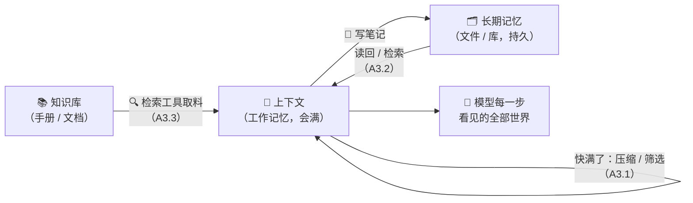

# A3 · 小结与自测

## 一图回顾

一句话收束：**上下文工程 = 决定模型每一步「看见什么」。** 工作记忆靠管理（压缩、筛选、读后即弃），长期记忆靠外置（记笔记，不是改参数），知识靠检索（把对的东西放进窗口）。三条管线的终点是同一个地方——那扇有限的窗口。

## 要点回顾

| 小节 | 两行版 |
| --- | --- |
| [A3.1 上下文 = 工作记忆](./01-context-window.mdx) | 循环每圈只增不减，撞墙是必然；硬扛必死、截断危险、压缩有损保命、外置最稳——真实系统混着用 |
| [A3.2 长期记忆](./02-long-term-memory.mdx) | 「记得你」= 外部存储 + 检索 + 装回上下文，参数一个没变；遗忘是功能，错误记忆比没记忆更糟 |
| [A3.3 Agentic RAG](./03-agentic-rag.mdx) | 经典 RAG 检索一发定生死；Agentic RAG 把检索交给循环——改写重搜、多轮补搜；检索质量仍是地基 |

## 综合自测

<Quiz questions={[
  {
    q: '长任务里上下文「只增不减」的根源是？',
    options: [
      '模型的记性太好',
      '行动循环的机制：每一轮的思考、调用和工具结果都会追加进上下文',
      '窗口本身在变小',
      '用户输入太长',
    ],
    answer: 1,
    explanation: 'A0 的循环决定了 messages 单调增长——工具结果（文件、日志）往往还特别大。这是结构性的，不是谁的错，所以必须靠策略管理。',
  },
  {
    q: '任务进行到一半、水位逼近上限，且早期有一条「必须遵守的接口约定」。最不该选的策略是？',
    options: [
      '把旧内容压缩成保留约定的摘要',
      '按时间截断，扔掉最早的内容',
      '把约定写进笔记文件，需要时读回',
      '把大的工具结果归档，只留结论',
    ],
    answer: 1,
    explanation: '按时间截断不看重要性——最早的内容里恰恰有那条约定。实验②的金额差 100 倍 bug 就是这么来的。其余三个选项都在「保住关键信息」的前提下腾空间。',
  },
  {
    q: '为什么说压缩（compaction）是「有损保命」？',
    options: [
      '压缩会让模型参数变少',
      '压缩用一次模型调用把旧对话变成摘要——空间省下了，但摘要原理上必然丢失部分细节',
      '压缩后任务必然失败',
      '压缩是免费且无损的',
    ],
    answer: 1,
    explanation: '摘要只能减损不能免损：保留决定与约定、丢弃过程细节是提示词能做的最好程度。实验③「丢的恰好不再需要」是剧本的仁慈，工程上必须假设丢的可能重要——所以关键信息要配合笔记外置。',
  },
  {
    q: '智能体「跨会话记得你的偏好」，正确的机制解释是？',
    options: [
      '每次会话后模型都被微调了一遍',
      '上下文在会话之间不会清空',
      '偏好存在外部（文件 / 库），新会话开始时被读回上下文——模型参数从未改变',
      '模型的训练数据里包含了用户信息',
    ],
    answer: 2,
    explanation: '「记忆」是外部存储 + 检索 + 装回的工程组合。参数训练完就定型（上篇第 5 章），把拟人化的「记住」还原成机制，才能理解它为什么会忘、为什么会记错、隐私边界在哪。',
  },
  {
    q: '用户的问题需要综合手册两个不同章节的内容才能答全。哪种方案最对症？',
    options: [
      '经典 RAG：检索一次 top-k，直接生成',
      '把整本手册塞进上下文',
      'Agentic RAG：模型先查一处，发现不全再改写查询补查另一处',
      '不检索，靠模型的参数知识回答',
    ],
    answer: 2,
    explanation: '答案分散正是经典 RAG 单发检索的失灵场景；整本塞入贵且腐烂；参数知识不含公司手册。多轮自主检索（查了发现不够再查）是为这个病根设计的解法。',
  },
  {
    q: '关于 RAG 系统的地基，哪个说法是对的？',
    options: [
      '只要模型够聪明，检索质量无所谓',
      '模型只能在检回来的内容里作答——切块、索引、检索的质量决定上限，库烂则全烂',
      '向量检索在任何场景都优于关键词检索',
      'Agentic RAG 不需要向量库',
    ],
    answer: 1,
    explanation: '再聪明的循环也救不了糟糕的索引——「垃圾进垃圾出」换个马甲重演（上篇 4.1 的老教训）。向量与关键词检索各有盲区（语义 vs 精确匹配），生产系统通常混合使用。',
  },
]} />

下一章 [A4 · 编排模式](../04-orchestration/index.md)：单个循环的内功修完了——五种把多次调用拼成系统的「积木」说明书。
