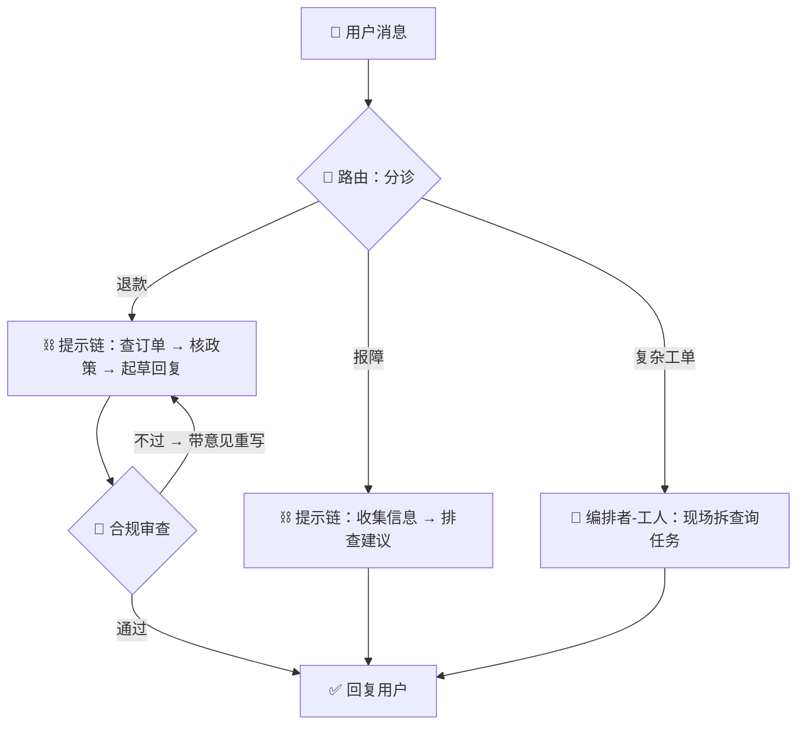

# A4.2 组合与选型：把积木拼成系统

## 一台客服系统，四种积木同台

真实系统很少只用一块积木。拿一个「智能客服」拼给你看：

- 最外层是**路由**：用户消息先分诊成「退款 / 报障 / 复杂工单」；
- 退款分支是一条**提示链**：查订单 → 核政策 → 起草回复，固定三步；
- 起草回复外面套着**评估者-优化者**：合规审查不通过就带意见重写——退款话术错不起；
- 复杂工单则升级为**编排者-工人**：现场拆解要查哪些系统，分头查完汇总。

四种积木各守一段，一台戏就齐了。这背后有两条值得记住的组合规律。

## 规律一：积木可以互相嵌套

任何积木里的「一步」，内部都可以是另一块积木——上面退款链的「起草回复」那一步，内部就是一个完整的评估循环。积木的接口天然统一（文本进、文本出），所以嵌套几乎是免费的。

这也是 [A0.2](../00-from-chat-to-action/02-autonomy-spectrum.mdx) 说「成熟产品是光谱混搭」的具体形态：宏观看是一台大<Term id="workflow">工作流</Term>，凑近看每一格里还有小结构。

## 规律二：越靠外层，越该保守

外层结构错了，全盘皆错——分诊错了，后面的链再精致也是在错误的通道里精致。所以拼法上有个铁律：**外层用可预测的积木（路由、链），里层才用灵活的（编排者、评估循环）**。

把最不确定的决策包在最里面，出了错影响面最小、也最容易定位。反过来「外层放个自由发挥的编排者、里层全是死流程」的系统，一旦编排者抽风，没有任何结构能兜住它。

## 选型：两连问

上一节实验的口诀展开成决策树就是两个问题：

1. **步骤能不能提前定死？** 定得死 → 看结构选前三种：一条线是链、分几类是路由、可同时是并行；定不死 → 编排者-工人。
2. **产出有没有清晰的及格线，且按意见改会变好？** 有 → 在关键产出外面套一层评估者-优化者；没有 → 别套，那是烧钱转圈。

## 拼到什么时候该换智能体？

积木拼久了会出现一种典型病：**分支爆炸**。路由从 3 类变成 9 类，每类里的链越来越长，特殊情况的 if 越写越多，改一处牵三处——维护者开始害怕自己的流程图。

这正是 A0.2 说的「路径无法枚举」信号：任务的真实形状已经超出了流程图的表达力。此时该把爆炸的那块**交给<Term id="agent">智能体</Term>循环**——让模型运行时自己决定路径，用围栏管住边界。

值得强调的是，**转化是双向的**（2025-2026 年成熟团队的常态）：

- **工作流 → 智能体**：分支爆炸、维护不动时，放权给循环；
- **智能体 → 工作流**：智能体跑了几千次后，日志里浮现出高度重复的稳定路径——把这些路径「结晶」成写死的工作流，省钱、提速、更稳。

工作流是智能体的化石，智能体是工作流的孵化器。系统在两者之间来回摆动，才是健康的演化。

:::caution 组合的代价：可观测性
积木每嵌套一层，排查一次失败就多跨一层。「用户投诉回复驴唇不对马嘴」——是分诊错了？链的第二步跑偏了？还是评估者放水了？嵌套三层之后，没有完整的<Term id="trace">轨迹</Term>日志就等于闭眼排障。所以拼积木的第一天就要给每块积木留日志（每步的输入、输出、耗时、token），这份纪律在 A7 章会长成完整的评测与排错方法论。
:::

<DeepDive title="组合系统的工程配套">

**统一的轨迹格式。** 每个步骤记录同一套字段：`{step_id, parent_id, input, output, model, tokens, latency_ms, status}`。父子关系（`parent_id`）让嵌套结构可以还原成一棵树——排障时先看哪一层的哪一步偏了，再下钻。这也是各家可观测性平台（2024-2026 年已成独立工具品类）的数据底座。

**预算与超时的层层传递。** 外层拿到总预算（token、时间、金额），给每个内层步骤分片：编排者给每个工人分预算、评估循环给每轮分预算。内层超支就地止损上抛，而不是把整个系统拖死——和分布式系统的超时传递是同一套思想。

**缓存与幂等。** 组合系统的重跑是常态（某一层失败重试）。相同输入的步骤结果要能缓存命中（省钱），有副作用的步骤要幂等（重跑不会发两封邮件）——写操作过 [A0.2 围栏](../00-from-chat-to-action/02-autonomy-spectrum.mdx)的老规矩在这里同样适用。

**灰度与回滚。** 提示词就是代码：新版本先切 5% 流量对比核心指标，跌了秒回滚。LLM 系统的上线纪律和传统软件完全一致——不同的只是「行为变化」更难从 diff 里看出来，所以更依赖 A7 章的回归评测集。

</DeepDive>

## 小结

:::tip 本节要点
- 积木可嵌套：任何「一步」内部都可以是另一块积木，接口天然统一。
- 外层保守、里层灵活：把最不确定的决策包在最里面。
- 选型两连问：步骤定得死吗（定不死用编排者）；有及格线吗（有就套评估层）。
- 工作流与智能体双向转化：分支爆炸就放权给循环，跑稳的路径就结晶回流程。
:::

<Quiz questions={[
  {
    q: '为什么建议「外层用路由和链，里层才用编排者和评估循环」？',
    options: [
      '因为路由和链的效果更好',
      '因为外层错误影响全局，应该用可预测的结构；灵活但方差大的结构包在里层，出错影响面小',
      '因为编排者-工人跑得更慢',
      '因为评估循环不能出现在外层，框架不支持',
    ],
    answer: 1,
    explanation: '这是风险布局问题，不是效果高低问题：分诊错了，后面全错。把不确定性最高的决策包在最里面，既控制了爆炸半径，也让排障有迹可循。框架层面没有任何限制。',
  },
  {
    q: '「退款回复的起草步骤里，内部套了一个合规审查循环」——这说明了积木的什么性质？',
    options: [
      '评估者-优化者只能用在退款场景',
      '积木可以互相嵌套：任何一步的内部都可以是另一块积木',
      '提示链最多只能有三步',
      '嵌套之后就变成了智能体',
    ],
    answer: 1,
    explanation: '积木的接口统一（文本进、文本出），所以嵌套几乎免费——链的一步可以是评估循环，编排者的工人可以是一条链。嵌套加深不改变「步骤由人定」的本质，所以它仍是工作流，不是智能体。',
  },
  {
    q: '你维护的客服工作流，路由类别从 3 类膨胀到 11 类，每类里的特殊 if 越来越多，改一处坏三处。按本节的建议，最该考虑的是？',
    options: [
      '继续加分支，把所有情况枚举完',
      '把评估循环的轮数调大',
      '把爆炸的部分交给智能体循环——这是「路径无法枚举」的信号，同时用围栏管住边界',
      '换一个更大的模型重写所有提示词',
    ],
    answer: 2,
    explanation: '分支爆炸说明任务的真实形状已超出流程图的表达力，硬枚举只会把系统写死。正确方向是局部放权给智能体（配合围栏），而它日后跑稳的路径还可以再结晶回工作流——双向转化。',
  },
]} />

## 延伸阅读

- [Anthropic Cookbook：Agent Patterns](https://github.com/anthropics/anthropic-cookbook)——五种积木的可运行示例代码。
- [12-Factor Agents](https://github.com/humanlayer/12-factor-agents)——2025 年流传很广的智能体工程清单，多条与本节的「外层保守」「轨迹先行」相呼应。
- 下一章 [A5 · 多智能体系统](../05-multi-agent/index.md)：把编排者手下的「工人」换成完整的智能体，会发生什么。
