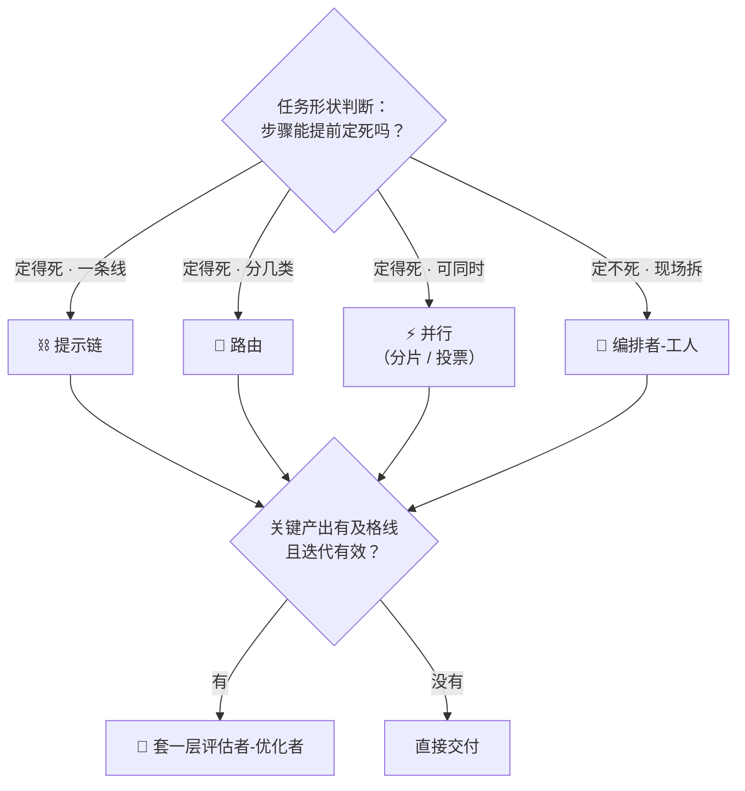

# A4 · 小结与自测

## 一图回顾

一句话收束：**积木没有高低，只有合不合适**——步骤定得死选前三种，定不死用编排者，有及格线就加评估层；拼装时外层保守、里层灵活，拼到分支爆炸就把那一块放权给智能体。

## 要点回顾

| 小节 | 两行版 |
| --- | --- |
| [A4.1 五种积木](./01-five-patterns.mdx) | 提示链 / 路由 / 并行 / 编排者-工人 / 评估者-优化者，各有结构、信号与失灵条件；编排者是唯一把「拆任务」交给模型运行时决定的积木 |
| [A4.2 组合与选型](./02-composition.mdx) | 积木可嵌套、外层要保守；两连问选型；工作流与智能体双向转化——爆炸就放权，跑稳就结晶 |

## 综合自测

<Quiz questions={[
  {
    q: '「新闻稿生成：写初稿 → 编辑模型按风格手册打分 → 不到 85 分带意见重写，最多三轮」。核心用的是哪块积木？',
    options: ['提示链', '路由', '评估者-优化者', '编排者-工人'],
    answer: 2,
    explanation: '「生成 → 打分 → 带意见重写」的循环是评估者-优化者的标准形状：有清晰及格线（85 分）、有轮次上限。它内部虽然有先后步骤，但「循环到达标」才是结构主干，不是一条单向的链。',
  },
  {
    q: '「用户上传的单据可能是发票、合同或报销单，先判断类型，再交给对应的专用抽取器」。这是哪块积木？',
    options: ['并行', '路由', '提示链', '评估者-优化者'],
    answer: 1,
    explanation: '一次分类决定走哪条专门通道——路由。注意它和并行的区别：每份单据只走一条通道，不是三个抽取器同时上。',
  },
  {
    q: '同样是「多路干活」，区分「并行」和「编排者-工人」的关键是什么？',
    options: [
      '路的数量多少',
      '子任务是写代码时就定死的，还是模型运行时看了任务才拆出来的',
      '用不用多个模型',
      '有没有汇总步骤',
    ],
    answer: 1,
    explanation: '并行的三路是预先写死的（安全/性能/风格）；编排者的子任务清单是运行时现拆的（调研报告查哪几个方向要看了资料才知道）。路数、模型数、有没有汇总，两者都可以相同。',
  },
  {
    q: '评估者-优化者和 A2.2 讲的「反思」是什么关系？',
    options: [
      '毫无关系，是两种独立技术',
      '评估者-优化者是反思的双角色版：生成和挑毛病分给两个调用，比一个模型闷头自查更容易看见问题',
      '反思已经过时，被评估者-优化者取代了',
      '评估者-优化者只用于翻译任务',
    ],
    answer: 1,
    explanation: '同一根杠杆（挑毛病比写对容易）的两种形态：反思是单角色的「自查」，评估者-优化者把评审独立成另一个调用——标准可以写得更狠，偏差共享也更少。它没有取代反思，轻量场景单角色自查依然够用。',
  },
  {
    q: '为什么组合系统要遵守「外层保守、里层灵活」？',
    options: [
      '因为外层的调用次数更多',
      '因为外层结构出错会波及全局，应交给可预测的路由和链；方差大的编排者与评估循环包在里层，控制爆炸半径',
      '因为里层的模型更便宜',
      '因为框架规定外层只能用路由',
    ],
    answer: 1,
    explanation: '这是风险布局：分诊一错、全程皆错，所以外层要最可预测；灵活结构包在里面，出错影响面小、定位也快。与调用次数、价格、框架限制都无关。',
  },
  {
    q: '关于工作流与智能体的「双向转化」，正确的描述是？',
    options: [
      '只能从工作流升级为智能体，不能反向',
      '分支爆炸时把那部分放权给智能体循环；智能体日志里跑稳的重复路径又可以结晶成写死的工作流——两个方向都在发生',
      '智能体成熟后就不再需要任何工作流',
      '双向转化只在实验室里成立，生产环境不可行',
    ],
    answer: 1,
    explanation: '2025-2026 年成熟团队的常态：流程图表达不动了就放权（配围栏），智能体跑出稳定路径就固化省钱。工作流是智能体的化石，智能体是工作流的孵化器——系统在两者之间来回摆动。',
  },
]} />

下一章 [A5 · 多智能体系统](../05-multi-agent/index.md)：把编排者手下的「工人」从单次调用升级成完整的智能体——它们怎么分工、怎么吵架、怎么用一套标准插头互相连接。
