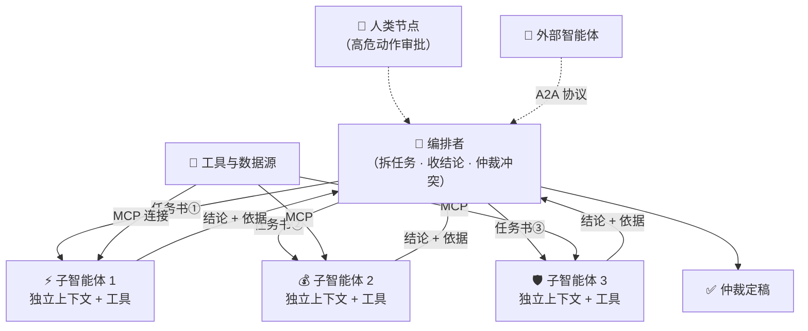

# A5 · 小结与自测

## 一图回顾

一句话收束：**多智能体 = 用协调成本，换上下文隔离、并行与对抗视角**。组织架构上层级制（编排者-工人）是生产主流；连接层上 MCP 连工具、A2A 连同僚，标准让接入从 M×N 变 M+N——但信任与安全的功课，一分都没少。

## 要点回顾

| 小节 | 两行版 |
| --- | --- |
| [A5.1 为什么要多个](./01-why-multi.mdx) | 三笔收益：隔离（买干净的工作记忆）、并行（墙钟≈最慢者）、对抗（审稿人就该挑刺）；三笔支出：总 token 更多、通信必丢信息、协调凭空出现 |
| [A5.2 协作形态](./02-collaboration.mdx) | 层级制绝对主流：冲突有人裁、任务书带边界、结论带依据；辩论学术有效生产少见；人是消息协议里的一等节点 |
| [A5.3 连接标准](./03-protocols.mdx) | MCP（2024）连工具已成事实标准，A2A（2025）连同僚尚早；插头标准≠电器质检，接第三方服务器=放陌生文本进上下文 |

## 综合自测

<Quiz questions={[
  {
    q: '「一份 300 页财报，需要同时从盈利、负债、现金流三个角度独立分析再汇总」——多智能体在这个任务上最核心的收益是？',
    options: [
      '总 token 消耗更少',
      '上下文隔离 + 并行：三个角度各用干净的上下文同时分析，主智能体只收结论',
      '不再需要人类审核',
      '模型变得更聪明',
    ],
    answer: 1,
    explanation: '三个分析角度互相独立——隔离让每条上下文不被其他角度的过程污染，并行让墙钟时间只算最慢的一路。总 token 反而更多（背景复制三份），这是拿总量换峰值的标准交易。',
  },
  {
    q: '工人交回「结论」时系统强制要求附上「依据、置信度、未尽事项」，这是在对抗哪个固有问题？',
    options: [
      '工人的模型能力不足',
      '通信即有损压缩——不指定保留字段，最影响决策的信息最容易被压掉',
      '工人会故意撒谎',
      '上下文窗口太小',
    ],
    answer: 1,
    explanation: '几千 token 的过程压成几百 token 的结论必然丢信息。结论模板的本质是「显式指定哪些信息不许丢」——依据让编排者能核查，置信度让仲裁有权重，未尽事项让追加取证有方向。',
  },
  {
    q: '为什么 2025-2026 年的生产系统几乎清一色采用编排者-工人，而不是自由讨论的「聊天室」拓扑？',
    options: [
      '因为聊天室拓扑实现难度太高',
      '结构越自由失败模式越多：话题漂移、循环扯皮、冲突无人裁决——层级制可预算、可审计、责任清晰',
      '因为编排者-工人不消耗 token',
      '因为协议只支持层级制',
    ],
    answer: 1,
    explanation: '这是行业用真金白银换来的教训：「不要造聊天室，要造流水线」。自由拓扑的每个自由度都是一种新的失败方式，而生产环境的第一需求是可控。',
  },
  {
    q: '编排者发现两个工人的结论互相矛盾，按代价从低到高的三种正确处理顺序是？',
    options: [
      '直接随机选一个 → 重跑全部任务 → 放弃',
      '有依据则直接裁决 → 追加定向取证 → 依据不足且高危时升级问人',
      '永远先问人 → 再裁决 → 再取证',
      '让两个工人辩论到一方认输',
    ],
    answer: 1,
    explanation: '仲裁按代价升级：编排者能裁就裁（最便宜）；裁不了就像剧场第 12 幕那样定向补一轮调研；仍不行且决策高危，才动用最贵的资源——人。凡事先问人会把 human-in-the-loop 变成 human-is-the-bottleneck。',
  },
  {
    q: 'MCP 与 A2A 各自解决哪一层连接？',
    options: [
      'MCP 连智能体与智能体，A2A 连模型与工具',
      'MCP 连模型与工具/数据源，A2A 连智能体与智能体',
      '两者都只连数据库',
      'MCP 管训练，A2A 管推理',
    ],
    answer: 1,
    explanation: 'MCP（Anthropic，2024-11）是「模型↔工具」的 USB-C；A2A（Google，2025-04）是「智能体↔同僚」的名片与握手。前者已是事实标准，后者生态尚早——记住分层，比记版本细节保值。',
  },
  {
    q: '接入一个第三方 MCP 服务器之前，最应该意识到的风险是？',
    options: [
      '它可能拖慢网络',
      '它的工具描述和返回结果会直接进入模型上下文——恶意文本可以在里面藏指令（提示注入）',
      '它可能不支持中文',
      '它会占用本地磁盘',
    ],
    answer: 1,
    explanation: '模型把上下文里的一切都当文本读，不会天然区分「说明书」与「命令」。标准让接入变容易的同时，也把「让陌生文本进入上下文」的门槛降到了一次配置——信任决策必须由人来做，A8 章正面展开。',
  },
]} />

下一章 [A6 · 智能体上电脑](../06-computer-use/index.md)：让智能体坐到电脑前——终端、编辑器、浏览器，以及为什么代码是智能体最成熟的领域。
