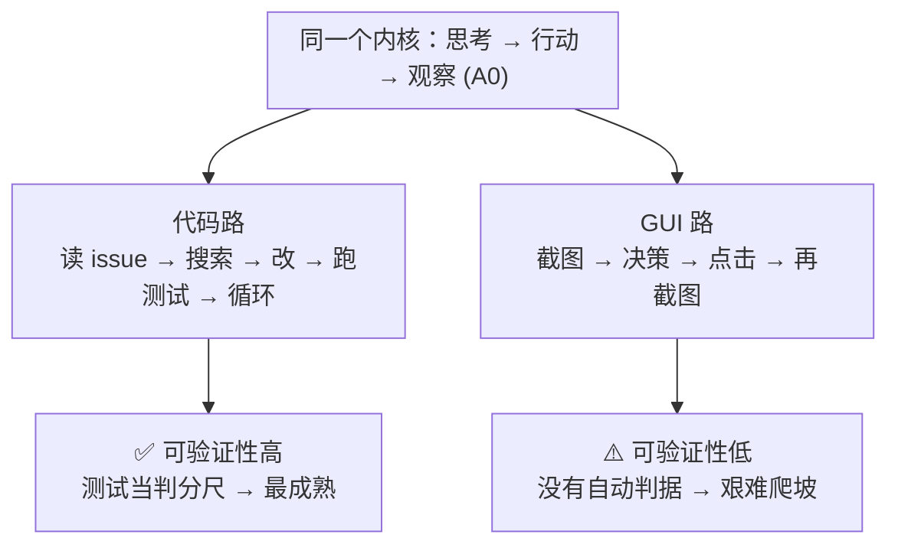

# A6 · 小结与自测

## 一图回顾

一句话收束：智能体坐到电脑前有两条路——**代码路**（终端+编辑器+测试）和 **GUI 路**（截图+鼠标键盘），共享同一个思考-行动-观察内核。两者成熟度的天壤之别，由一个词决定：**可验证性**。代码有测试当自动判分尺，所以领跑；计算机使用没有，所以艰难。这把尺子，也是贯穿全书的一条暗线。

## 要点回顾

| 小节 | 两行版 |
| --- | --- |
| [A6.1 代码智能体](./01-code-agents.mdx) | 工具箱朴素得像人类桌面：终端+编辑器+测试；标准循环是 A0+A1+A2 的合体；测试是它的「眼睛」 |
| [A6.2 为什么代码最成熟](./02-why-code.mdx) | 可验证性三优势（即时反馈+带标签数据+可验证奖励）形成能力飞轮；可验证性光谱是全书暗线 |
| [A6.3 计算机使用](./03-computer-use.mdx) | 看截图动鼠标操作无 API 软件；难在多模态感知+动作脆+慢+几乎不可验证；把安全推到极致 |

## 综合自测

<Quiz questions={[
  {
    q: '代码智能体的「标准桌面」是哪三样？',
    options: [
      '浏览器 + 邮箱 + 日历',
      '终端 + 文件编辑器 + 测试',
      '数据库 + API 网关 + 缓存',
      '截图 + 鼠标 + 键盘',
    ],
    answer: 1,
    explanation: '朴素得和人类程序员一模一样：一个终端跑命令、一个编辑器改文件、一套测试看反馈。第四项「截图+鼠标+键盘」是 A6.3 计算机使用的接口，不是代码智能体的。',
  },
  {
    q: '为什么说「测试是代码智能体的眼睛」？',
    options: [
      '测试能让代码跑得更快',
      '测试给了它客观即时的对错反馈，让「有依据的反思」得以成立——没有测试，治标不治本的错误改动会被当成成功',
      '测试能替它写代码',
      '测试能减少 token 消耗',
    ],
    answer: 1,
    explanation: '回扣 A2.2：反思要有依据才有效。测试就是那个依据——报错和失败用例客观地告诉智能体「这么改不对」。A6.1 重放里，它第一次改错方向正是被测试拦下的。没有这双眼睛，它根本不知道自己改对没有。',
  },
  {
    q: '把「单元测试 → 数学 → SQL → 网页抽取 → 开放写作 → 情感陪伴」排成一条线，这条「可验证性光谱」说明了什么？',
    options: [
      '任务从难到易排列',
      '反馈越客观即时（越靠硬端）的任务，智能体越早成熟；这条暗线贯穿 RLVR、评测、Agentic RL',
      '这些任务用不同的模型',
      '光谱只和写代码有关',
    ],
    answer: 1,
    explanation: '光谱刻画的是「能多大程度自动判对错」，不是难易。硬端能自动生成训练和评测信号、驱动能力飞轮，所以先成熟。它从上篇 RLVR、评测章一路延伸到下篇 A7、A8.3，是预测「哪种智能体先靠谱」的总钥匙。',
  },
  {
    q: '同样看起来不复杂，为什么「订机票」类任务比「修 bug」难做成可靠的智能体？',
    options: [
      '订机票需要更多工具',
      '订机票不可验证（没有自动判据说「订对了」）、不可回滚、错误代价真实——恰是代码三优势的反面',
      '航空公司不让智能体访问',
      '机票数据太大',
    ],
    answer: 1,
    explanation: '不是难度问题。修 bug 有测试当判据、改错能 revert、沙箱里试错零成本；订机票没有「成功」的自动判据、扣款不可撤销、错了是真金白银。可验证、可回滚、错误便宜——代码占全了，订票一个都不占。',
  },
  {
    q: '计算机使用智能体最根本的困难是什么？',
    options: [
      '屏幕太大截图太慢',
      '几乎不可验证——点对没对、填错没错没有自动判据，导致反思空想化、能力飞轮转不起来',
      '鼠标驱动不兼容',
      '模型看不懂中文界面',
    ],
    answer: 1,
    explanation: '看界面难（多模态短板）、动作脆、慢都是困难，但最根本的是不可验证——回扣 A6.2 那把尺子。没有测试那样的自动判据，有依据的反思和可验证奖励都无从谈起，这是它落后于代码的结构性原因。',
  },
  {
    q: '关于计算机使用的安全，业界 2025-2026 年的普遍共识是？',
    options: [
      '它足够安全，无需特别防护',
      '因为它能操作你所有软件、易被提示注入劫持，应最小权限 + 隔离环境运行 + 不碰真实敏感账户 + 高危动作人工确认',
      '只要模型够强就安全',
      '把它接入越多软件越安全',
    ],
    answer: 1,
    explanation: '一双能点遍全屏、操作一切软件的手，一旦被网页里的注入劫持，破坏力等同其能力。所以它比其他智能体更依赖 A8 的安全垫：最小权限、沙箱隔离、避开真实敏感账户、高风险操作一律人工把关。能力越通用，缰绳越要收紧。',
  },
]} />

下一章 [A7 · 评测与可靠性](../07-agent-evaluation/index.md)：造得出来只是开始——怎么知道它到底靠不靠谱？
