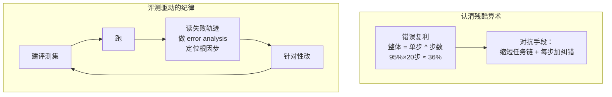

# A7 · 小结与自测

## 一图回顾

一句话收束：智能体的可靠性是**算出来的，不是许愿来的**。先认清 `整体成功率 = 单步成功率 ^ 步数` 这条残酷的连乘算术——它解释了为什么 demo 惊艳、上线拉胯；再用**评测驱动开发**的纪律（建集 → 跑 → 读轨迹找根因 → 改 → 回归）一点点把每步的有效成功率抬上去。凭手感调提示词的人和用数据说话的人，做出的东西不在一个可靠性量级上。

## 要点回顾

| 小节 | 两行版 |
| --- | --- |
| [A7.1 错误的复利](./01-error-compounding.mdx) | 成功率是连乘不是平均：单步 95%×20 步≈36%；对策是缩短链+每步纠错；稳定性看 pass^k 而非单次 |
| [A7.2 智能体 Benchmark](./02-benchmarks.mdx) | 给「会办事」打分难在搭能自动判成功的真实环境；SWE-bench/GAIA/τ-bench；判据要基于状态而非输出文本 |
| [A7.3 评测驱动开发](./03-eval-driven.mdx) | 像调试概率机器一样开发：建集、跑、读失败轨迹做 error analysis 找根因步；评测集本身会过拟合要保鲜 |

## 综合自测

<Quiz questions={[
  {
    q: '一个智能体单步成功率 95%，任务需要 20 步。整体成功率约是多少？为什么？',
    options: [
      '还是 95% 左右，单步很准整体就准',
      '约 36%，因为成功率是连乘（0.95 的 20 次方）不是平均',
      '约 75%，取平均',
      '100%，只要每步都可能成功',
    ],
    answer: 1,
    explanation: '整体成功率 = 单步 ^ 步数 = 0.95²⁰ ≈ 0.36。成功要求每一步都不出错，所以是连乘。这就是「错误复利」——单步听着很高，几十步连乘下来惨不忍睹。',
  },
  {
    q: '为什么智能体的 demo 常常惊艳、真上线却频频翻车？',
    options: [
      '演示视频造假',
      '因为 demo 通常步数少（连乘衰减不明显），真实任务步数多，错误复利把整体成功率拖垮了',
      '因为上线后模型被换了',
      '因为用户不会用',
    ],
    answer: 1,
    explanation: '不是造假，是数学。demo 挑的是几步就能完成的顺滑案例，连乘衰减还没显现；真实任务动辄几十步，同样的单步成功率经连乘后整体崩塌。这也是为什么「缩短任务链、每步加纠错」是硬道理。',
  },
  {
    q: '为什么衡量智能体稳定性要看 pass^k（连跑 k 次全部成功）而不是「跑一次成不成功」？',
    options: [
      'pass^k 计算更简单',
      '因为轨迹有随机性：一个 30% 成功率和一个 99% 的，单次跑都可能「成功」，pass^k 才能照出「次次都得办对」的真实稳定性',
      '因为跑一次太贵',
      'pass^k 和单次没区别',
    ],
    answer: 1,
    explanation: 'A0 讲过每步都是采样、轨迹天然随机。只看单次成功会把「偶尔灵」和「次次灵」混为一谈。pass^k 要求连续 k 次全成功，专门照出稳定性——对「错不起」的生产场景，这才是有意义的指标。',
  },
  {
    q: '给智能体 benchmark 打分，最核心的难点是什么？',
    options: [
      '题目不够多',
      '要搭一个能自动、客观判定「事到底办成没办成」的真实环境——而且判据要看最终状态（订单真建了吗、文件真改对了吗）而非只看输出文本',
      '模型跑得太快',
      '没有人愿意出题',
    ],
    answer: 1,
    explanation: '给聊天模型打分是看「答得对不对」，给智能体打分是看「事办成没办成」——后者要一个可复位的真实环境 + 基于状态的成功判据。只看模型「说自己做完了」会被漂亮话骗过，必须去检查世界真实的最终状态。',
  },
  {
    q: 'A7.3 排错游戏教的「找第一张倒下的多米诺」，指的是什么？',
    options: [
      '盯着最后崩溃的那一步修',
      '定位「第一处真正出错的根因步」——一旦某步错了，后面每步都会「正确地」基于错误前提推进，把错误伪装得天衣无缝',
      '把所有步骤全部重做',
      '只看最终答案对不对',
    ],
    answer: 1,
    explanation: '智能体排错的核心是找根因步，不是崩溃步。订机票题里第 2 步日期填错，后面订单、答复都「正确地」基于错日期展开、毫无破绽。所以要顺着轨迹回溯到第一处出错的地方——这也是为什么完整轨迹日志是命根子。',
  },
  {
    q: '关于评测集，下列哪个说法是对的？',
    options: [
      '评测集一旦建好就一劳永逸',
      '评测集本身会过拟合：只盯着它改，会像刷榜一样自欺——要持续补充线上真实失败案例，保持「新鲜考题」',
      '评测集越小越好',
      '评测集只能用 LLM 当裁判',
    ],
    answer: 1,
    explanation: '回扣上篇评测章的刷榜教训：把某个固定集合当唯一目标去优化，就会过拟合它、在真实场景里失真。评测集要像活水一样不断纳入线上新出现的失败案例，才能持续反映真实表现。',
  },
]} />

下一章 [A8 · 安全与未来](../08-safety-frontier/index.md)：能力越强、失败越贵——智能体的安全底线与最后的展望。
