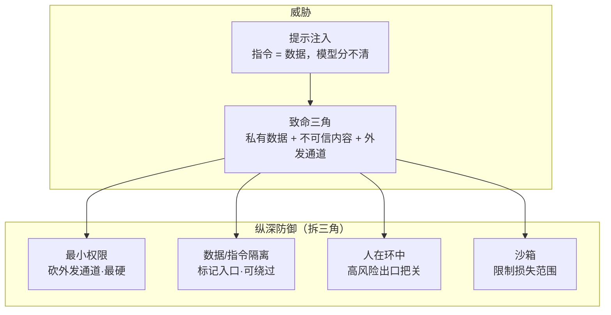

# A8 · 小结与自测

## 一图回顾

一句话收束：提示注入的根，是模型分不清「指令」和「数据」——两者都是上下文文本。它没法在模型层面根治，但可以在系统层面缓解：认准**致命三角**（私有数据 + 不可信内容 + 外发通道），用**最小权限、隔离、人在环中、沙箱**层层设防，拆掉任一条边攻击即不成立。安全不是做完的功能，是持续的工程纪律。

## 要点回顾

| 小节 | 两行版 |
| --- | --- |
| [A8.1 提示注入与致命三角](./01-prompt-injection.mdx) | 恶意指令藏进智能体会读的内容里冒充用户意图；间接注入最危险；致命三角三缺一即不成立 |
| [A8.2 防御工程](./02-defense.mdx) | 不靠调乖模型，靠拆三角：最小权限最硬、隔离可绕、人在环中把关、沙箱兜底；纵深防御无银弹 |
| [A8.3 未来与结语](./03-future.mdx) | Agentic RL 把 RLVR 推广到多步任务、难在信用分配；智能体不是魔法，是工具+循环+工程 |

## 综合自测

<Quiz questions={[
  {
    q: '「致命三角」指的是哪三样同时具备才会酿成数据失窃？',
    options: [
      '大模型 + 大数据 + 大算力',
      '能接触私有数据 + 会读到不可信内容 + 有对外发送通道',
      '规划 + 记忆 + 工具',
      '预训练 + SFT + RLHF',
    ],
    answer: 1,
    explanation: '私有数据是「可偷的东西」、不可信内容是「注入的入口」、外发通道是「数据外泄的出口」。三者齐备通道才打通，拆掉任一角攻击即不成立——这正是防御设计的靶心。',
  },
  {
    q: '为什么提示注入不能像 SQL 注入那样被「彻底根治」？',
    options: [
      '因为大模型跑得慢',
      '因为 SQL 注入可以用参数化查询真正分离代码和数据，而大模型里「指令」和「数据」本质是同一种东西（都是上下文文本），无法彻底分离',
      '因为没人研究这个问题',
      '因为注入指令太短',
    ],
    answer: 1,
    explanation: 'SQL 注入的根治靠「把代码和数据放进两条真正独立的通道」。大模型没有这种隔离——系统提示、用户指令、外部内容全是同一条上下文里的 token，共享同一个注意力。所以只能缓解（拆三角、纵深防御），不能像 SQL 那样根除。',
  },
  {
    q: '四道防线里，为什么说「最小权限」比「数据/指令隔离」更可靠？',
    options: [
      '因为它更容易实现',
      '因为隔离依赖模型「判断得对」而判断可被狡猾伪装骗过；最小权限从能力上砍掉危险动作，不依赖模型判断',
      '因为最小权限能识别所有攻击',
      '两者其实一样可靠',
    ],
    answer: 1,
    explanation: '隔离要靠模型「不执行数据区的指令」，而足够权威的伪装可能突破这个判断。最小权限则让危险动作压根不在能力集里——模型再怎么被骗，也调用不出一个不存在的权限。安全建立在架构上，比建立在模型自觉上更硬。',
  },
  {
    q: '关于「人在环中」的确认，为什么「每一步都要用户确认」反而是个坏设计？',
    options: [
      '因为太安全了',
      '因为会导致「确认疲劳」：用户对大量安全请求麻木后条件反射点同意，恶意请求就混过去了',
      '因为用户没时间',
      '因为模型会不高兴',
    ],
    answer: 1,
    explanation: '如果 99% 的确认都无害，用户会养成「无脑点同意」的习惯，第 100 次的恶意请求正好被这个习惯放过——确认疲劳本身成了漏洞。正确做法是按风险分级，让确认少而精，只留给真正不可逆/涉钱/外发的高风险动作。',
  },
  {
    q: 'Agentic RL（智能体强化学习）与上篇 RLVR 的关系，以及它的核心难点是？',
    options: [
      '完全无关的新技术；难点是算力',
      '是 RLVR 从「单轮可验证任务」到「多步轨迹」的推广；核心难点是多步任务的信用分配（失败了到底哪一步的错）',
      '是 SFT 的别名；难点是数据标注',
      '是一种推理框架；难点是延迟',
    ],
    answer: 1,
    explanation: 'RLVR 用「可自动判对错」训练单轮任务，Agentic RL 把它推广到多步：让模型在真实环境里跑完整条轨迹、用最终成败当奖励。最大难点是信用分配——一条长轨迹最后失败，很难判定是哪一步的责任（正是 A7.3「找根因步」的训练版），加上真实环境跑轨迹又慢又贵、成功样本稀少。',
  },
  {
    q: '下篇反复出现的一条暗线是「可验证性决定成熟度」。以下哪个说法最符合它？',
    options: [
      '模型参数越多，智能体越可靠',
      '环境能不能自动、即时、客观地判定「做对没有」，很大程度决定了这类智能体任务的成熟度——所以写代码（有测试）领跑，订机票、开放操作（难判定）艰难',
      '智能体只要有工具就一定可靠',
      '可验证性只和数学题有关',
    ],
    answer: 1,
    explanation: '这条暗线贯穿 A6（代码因可验证而领跑）、A7（评测优先用能自动判的客观指标）、A8.3（Agentic RL 靠可验证奖励驱动飞轮），也接上篇的 RLVR。可自动判对错 → 能生成海量训练与评测信号 → 能高效改进——反之则处处受制。它是理解「为什么有的智能体能商用、有的还在翻车」的一把总钥匙。',
  },
]} />

🎉 **恭喜你读完了《智能体是怎么工作的》全篇！** 别忘了去 [A8.3 结语](./03-future.mdx) 看你的下一步，以及到[实战附录](../appendix/index.md)亲手写一个智能体。
