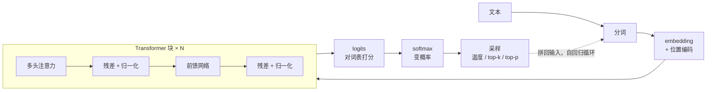

# 第 3 章 · 小结与自测

## 一张图看全章

用一段话串起来：第 2 章的网络孤立地处理每个输入，而语言活在上下文里——**注意力**让每个词按相关度加权取用全句的信息（3.1），具体靠 Q、K、V 的「软查字典」实现（3.2）；**多头**让模型同时用多种眼光扫视句子，**位置编码**补上词序（3.3）；**残差与层归一化**保证这套结构叠几十上百层不塌（3.4）；拼装成整机后，token 走完「向量化 → N 层块 → logits → softmax」的流水线，每趟产出一个字、拼回去再来一趟（3.5）；最后由**温度、top-k、top-p** 决定从概率表里怎么挑字（3.6）。

## 六节要点回顾

| 小节 | 记住这两件事 |
| --- | --- |
| [3.1 注意力的直觉](./01-attention-intuition.mdx) | 注意力 = 按相关度加权平均；权重每行加起来是 100% |
| [3.2 Q、K、V](./02-qkv.mdx) | 拿问题（Q）匹配索引（K）取内容（V）；打分过 softmax 变成权重 |
| [3.3 多头与位置编码](./03-multihead-position.mdx) | 一个头一种关注模式，多头并行；注意力天生不分先后，位置要额外注入 |
| [3.4 残差与层归一化](./04-residual-layernorm.mdx) | 输出 = 输入 + 修正量，梯度有直达电梯；归一化是音量调平器 |
| [3.5 拼装一个 GPT](./05-gpt-assembly.mdx) | 主干 = （注意力 + 前馈）× N；自回归一次只产一个 token |
| [3.6 采样与生成](./06-sampling.mdx) | 模型给概率、采样定文字；温度 → top-k → top-p → 掷骰子 |

## 综合自测

<Quiz questions={[
  {
    q: '注意力机制的本质操作是什么？',
    options: [
      '把最重要的一个词挑出来，其余全部丢弃',
      '每个词按「相关程度」对全句的信息做加权平均',
      '把句子里的词按重要性重新排序',
      '统计每个词在语料里的出现频率',
    ],
    answer: 1,
    explanation: '注意力是「软」选择：不是只取一个，而是人人有份、按相关度分配权重（每行合计 100%），再加权取用——所以梯度能顺畅地流过它，整个机制可以端到端训练。',
  },
  {
    q: '为什么 Transformer 必须额外注入位置编码？',
    options: [
      '因为词表里没有存位置信息',
      '因为注意力的加权求和对输入顺序天生无感，打乱词序结果不变',
      '为了让模型跑得更快',
      '为了节省参数',
    ],
    answer: 1,
    explanation: '注意力只看「内容相关度」，把「小猫追蝴蝶」打乱成「蝴蝶追小猫」，每个词算出的加权结果不变——顺序信息必须靠位置编码（如 RoPE）额外发「工牌」补进去。',
  },
  {
    q: '因果遮罩（causal mask）的作用是？',
    options: [
      '防止模型看到脏话',
      '生成式模型只许每个词看它前面的词，不许偷看未来',
      '把注意力权重变成 0 和 1',
      '减少一半计算量，纯属省钱',
    ],
    answer: 1,
    explanation: '训练时整句话都在眼前，若不遮住右侧，模型直接抄答案就能「预测」下一个词，什么都学不到；生成时未来本来就不存在。遮罩保证训练和生成的规则一致。',
  },
  {
    q: '没有残差连接的一百层网络，最典型的下场是？',
    options: [
      '训练很慢但最终效果一样',
      '梯度在层层连乘中消失或爆炸，底层根本训不动',
      '参数太多导致显存不足',
      '只会影响生成速度，不影响训练',
    ],
    answer: 1,
    explanation: '反向传播是逐层连乘：一百个小于 1 的数乘起来趋近 0（消失），大于 1 则爆炸。残差的「+输入」给梯度加了一条恒等直达通道，把连乘变成「1 + 修正」，百层才训得动。',
  },
  {
    q: '关于 GPT 的自回归生成，哪个说法是对的？',
    options: [
      '模型一次前向就能吐出完整的一段话',
      '每生成一个 token 都要完整跑一遍流水线，长回答就是循环几百圈',
      '生成 100 字只需要跑 12 层网络各一次',
      '自回归是指模型会自动回归到出厂设置',
    ],
    answer: 1,
    explanation: '一趟前向 = 一个 token：算出概率、掷骰子、拼回输入、再来一趟。这也是长回答又慢又贵的根源，第 6 章的 KV Cache 就是为了给这个循环省力。',
  },
  {
    q: '你希望模型写代码时输出稳定、写故事时脑洞大开，应该分别怎么调温度？',
    options: [
      '写代码调高温度，写故事调低温度',
      '写代码调低温度（接近 0），写故事适当调高温度',
      '两者都用最高温度',
      '温度不影响输出内容，随便设',
    ],
    answer: 1,
    explanation: '低温把分布削尖，几乎必选第一名，输出稳定可复现——适合代码、数学；高温抹平分布，冷门词上位，多样性和「胡说」一起来——适合创意写作。这是推理期工艺，不用重新训练。',
  },
]} />

## 下一步

骨架已经竖起来了——但此刻它还是一副**随机初始化的空壳**，一个字也不会说。

下一章去工业现场：十几万亿词的数据从哪来、怎么洗？Scaling Laws 如何指导「买多少卡、喂多少数据」？几千张 GPU 怎么分工协作？训练崩了怎么救？

→ [第 4 章 · 预训练：真正的「炼丹」](../04-pretraining/index.md)
