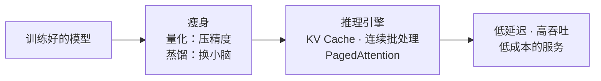

# 第 6 章 · 小结与自测

## 全章鸟瞰

一句话串联全章：**训练只发生一次，推理每天发生几十亿次**——所以推理工程的地位一点不比训练低。它的全部工作，是在**延迟、吞吐、成本、质量**这四个互相拉扯的角里找平衡：KV Cache 拿显存换计算（6.2），量化拿一点精度换体积和带宽（6.3），连续批处理和 PagedAttention 榨干每一分算力和显存（6.4），蒸馏干脆用一个小模型换掉大模型（6.5）。而这一切优化的起点，是先看清瓶颈在哪——推理慢，慢在「搬运」而不是「计算」（6.1）。

## 要点回顾

| 小节 | 两行要点 |
| --- | --- |
| [6.1 训练 vs 推理](./01-train-vs-infer.mdx) | 自回归生成一次只出一个 token；解码阶段的瓶颈是显存带宽（搬权重），不是算力。 |
| [6.2 KV Cache](./02-kv-cache.mdx) | 历史 token 的 K、V 不变，缓存起来免重算——计算量从「三角形」降为「一行」；代价是显存随上下文线性膨胀。 |
| [6.3 量化](./03-quantization.mdx) | 用更少比特存权重：int8 几乎白赚，int4 靠分组缩放也能用——亿万参数对小误差很迟钝。 |
| [6.4 推理服务框架](./04-serving.mdx) | 连续批处理：谁完了立刻换人，GPU 永远坐满；PagedAttention：像操作系统分页一样管理 KV 显存，浪费从 60%+ 降到 4% 以下。 |
| [6.5 蒸馏与小模型](./05-distillation.mdx) | 软标签里的暗知识让学生继承老师功力；数据蒸馏连「思考方式」都能传承；量化/蒸馏/剪枝可叠加。 |

## 综合自测

<Quiz questions={[
  {
    q: '推理的两个阶段里，预填充（prefill）和解码（decode）的瓶颈分别是什么？',
    options: [
      '两个阶段都卡在算力',
      '预填充卡算力（整段并行计算），解码卡显存带宽（每步都要搬全部权重）',
      '预填充卡显存带宽，解码卡算力',
      '两个阶段都卡在网络延迟',
    ],
    answer: 1,
    explanation: '预填充把整段提示词并行算完，是算力密集型；解码每生成一个 token 都要把全部权重从显存搬进计算单元一次，算得很少搬得很多——瓶颈是带宽。这也是为什么两者适合分开部署优化。',
  },
  {
    q: 'KV Cache 的本质交换是什么？',
    options: [
      '用计算换显存：多算一点，少存一点',
      '用显存换计算：存下历史 K/V，免去每步重算',
      '用精度换速度：把 K/V 存成低精度',
      '用带宽换延迟：提前把权重搬到缓存',
    ],
    answer: 1,
    explanation: '历史 token 的 K、V 向量在生成过程中不会变，存起来就不用每步重算——每一步的注意力计算量从整个三角形缩成一行。代价是缓存随上下文长度线性增长，成为长对话的显存大户。',
  },
  {
    q: '为什么 int4 量化（每个权重只剩 16 个刻度）还能保住模型大部分能力？',
    options: [
      '因为模型权重本来就只有 16 种取值',
      '因为亿万个参数的小误差相互抵消，加上分组缩放让每组权重用自己的刻度尺',
      '因为量化后会重新训练一遍',
      '因为 int4 只用于不重要的层',
    ],
    answer: 1,
    explanation: '大模型对单个权重的小误差非常迟钝——海量参数的误差在统计上互相抵消；再配合分组缩放（每几十个权重共享一把自适应刻度尺）等技巧，4 bit 就能保住绝大部分能力。这是 2024-2025 年本地部署的主流精度。',
  },
  {
    q: '连续批处理（continuous batching）解决的核心浪费是什么？',
    options: [
      'KV 缓存占用太多显存',
      '模型权重加载太慢',
      '静态批处理里，先生成完的请求占着位置干等整批结束',
      '不同请求的提示词长度不同',
    ],
    answer: 2,
    explanation: '回答有长有短，「整批进整批出」意味着短回答写完后位置空烧、门外请求干排队。连续批处理按「生成一步」为粒度调度，谁完了立刻下车换新请求——GPU 永远满载。',
  },
  {
    q: 'PagedAttention 管理 KV 缓存的方式，最贴切的类比是？',
    options: [
      '图书馆的借书证制度',
      '操作系统的虚拟内存分页：小页按需分配，页表串起零散物理页',
      '銀行的定期存款',
      '快递柜的随机分配',
    ],
    answer: 1,
    explanation: '不再为每个请求预留连续大块，而是切成固定小页按需分配，用块表（页表）把零散物理页映射成逻辑连续序列——和 OS 虚拟内存机制一比一对应，显存浪费从 60%+ 降到 4% 以下（2023 年论文数字）。',
  },
  {
    q: '蒸馏时让学生学老师的「软标签」而不只是正确答案，价值在哪？',
    options: [
      '软标签文件更小，训练更快',
      '错误选项之间的相对概率藏着老师的「审题直觉」（暗知识），学生一并继承',
      '软标签可以避免过拟合',
      '软标签不需要老师模型参与',
    ],
    answer: 1,
    explanation: '「猫 70%、狗 25%、汽车 0.01%」告诉学生的不只是答案，还有整个类别空间的远近关系——这是老师泛化能力的浓缩。只学「答案是猫」，这层知识就全丢了。',
  },
]} />

## 下一章

模型跑得又快又省了——但它到底**好不好**？「好」由谁说了算？考题会泄露、裁判有偏心、榜单能刷分……[第 7 章 · 评测](../07-evaluation/index.md)教你带着怀疑读懂任何一张排行榜。
