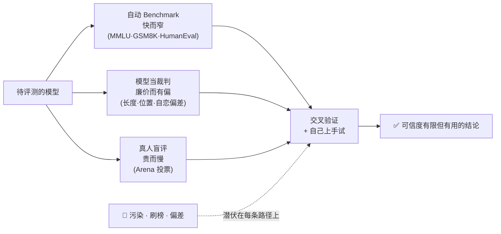

# 第 7 章 · 小结与自测

## 全章鸟瞰

评测没有单一的可靠仪器，只有三类各有短板的手段互相补位——中间还蹲着三只拦路虎：

一句话串起三节：先认识考卷（7.1：每张 benchmark 各考一面，打分方式决定客观程度，考卷会饱和），再认清水分（7.2：数据污染让模型「背题」、古德哈特定律让刷榜必然发生、模型裁判自带三大偏差），最后亲身上阵（7.3：你的直觉偏差和标注员、奖励模型、LLM 裁判的偏差是同一个问题的四次出场）。

## 要点回顾

| 小节 | 两行要点 |
| --- | --- |
| [7.1 Benchmark 动物园](./01-benchmarks.mdx) | 没有统一高考，只有几十张各考各的卷子；代码题判分最硬、开放对话最主观。考卷会被「考满」（饱和），榜单只是时间切片。 |
| [7.2 评测的坑](./02-pitfalls.mdx) | 污染=背题、刷榜=古德哈特定律、模型裁判=有偏差的镜子。对策：改写重测、新鲜考题、交换位置、多裁判集成、交叉验证。 |
| [7.3 你来当评委](./03-judge-game.mdx) | 长度、自信、文风偏差对所有打分者一视同仁；「打分者偏爱什么，被打分者就变成什么」贯穿对齐与评测全链条。 |

## 综合自测

<Quiz questions={[
  {
    q: 'MMLU 和 HumanEval 分别主要考察什么？',
    options: [
      '都考数学推理',
      'MMLU 考 57 科知识广度（选择题），HumanEval 考写代码过测试用例',
      'MMLU 考对话体验，HumanEval 考指令遵循',
      'MMLU 考写代码，HumanEval 考知识',
    ],
    answer: 1,
    explanation: 'MMLU 是覆盖 57 个学科的四选一选择题，测知识广度；HumanEval 让模型按注释写 Python 函数并运行测试用例，判分最客观。认清每张卷考什么，是读懂榜单的第一步。',
  },
  {
    q: '「benchmark 饱和」带来的直接后果是什么？',
    options: [
      '模型再也无法进步了',
      '这张考卷失去区分度，只能不断出更难的新卷（GPQA、HLE 等）',
      '所有模型的分数会开始下降',
      '评测成本大幅上升',
    ],
    answer: 1,
    explanation: '头部模型逼近满分（以及卷子自身的错题率上限）后，分数差异不再反映能力差异——评测变成移动的靶子，出卷人被迫持续加码。',
  },
  {
    q: '数据污染让分数失真的机制是？',
    options: [
      '污染的数据让模型能力下降',
      '考题和答案混在万亿级训练语料里，模型靠「背过原题」得分，而非真的会做',
      '评测机构偷偷修改了考题',
      '模型在考试时联网搜索了答案',
    ],
    answer: 1,
    explanation: 'benchmark 考题早被论文、博客贴满互联网，而互联网正是预训练语料——去重工序删不干净。所以「换数字改写重测掉分多少」成了检验分数含金量的照妖镜（GSM1K 实验，2024）。',
  },
  {
    q: '古德哈特定律「指标一旦成为目标就不再是好指标」，在本书中的两次典型出场是？',
    options: [
      '梯度下降与反向传播',
      '模型钻奖励模型的空子（reward hacking），和厂商针对评测集刷榜',
      '数据清洗与数据配比',
      'KV Cache 与量化',
    ],
    answer: 1,
    explanation: '5.4 节：模型全力优化奖励分→学会灌水讨好而非变好；7.2 节：厂商全力优化榜单分→刷题过拟合而非提升能力。主语不同，机制完全同构——任何单一数字被全力优化时都会和真实目标脱钩。',
  },
  {
    q: '下面哪一项不是「模型当裁判」的三大实证偏差之一？',
    options: ['长度偏差', '位置偏差', '自恋偏差（偏爱与自己相似的文风）', '污染偏差'],
    answer: 3,
    explanation: '三大实证偏差是长度、位置、自恋（MT-Bench 研究，2023）。数据污染是考生（被测模型）侧的问题，不是裁判的判分偏差——两者都让分数失真，但机制不同。',
  },
  {
    q: '收集人类评审时更推荐「两两比较」而非「打绝对分」，因为？',
    options: [
      '比较法可以全自动完成',
      '打分需要专业资质',
      '绝对分数的尺度因人因时漂移严重，相对比较稳定得多——RLHF 收集偏好用的也是同一招',
      '比较法能防止数据污染',
    ],
    answer: 2,
    explanation: '手松手紧、上午下午不一致——绝对打分噪声大；「谁更好」的相对判断稳定得多。5.3 节 RLHF 用成对偏好训练奖励模型、Arena 用对战投票排名，都是这条方法学的应用。',
  },
]} />

## 下一站

评完了当下，最后一章看向前方：[第 8 章 · 前沿与全景](../08-frontier/index.md)——MoE 怎么让万亿参数只付百亿账单、上下文怎么从 4K 卷到百万、图像怎么变成 token、以及「多想一会儿」的推理模型是怎么训练出来的。终点还有一张收束全书的全景大图等你下载。
