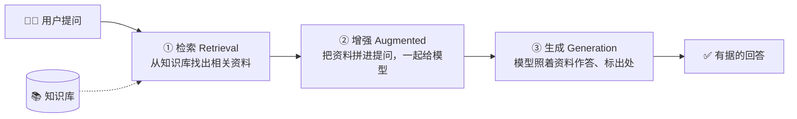

# K0.2 RAG：开卷考试

## 一个学生的两种考法

想象两个学生考同一场「公司制度」的试：

- **学生 A** 闭卷：全靠考前背，背到的就答得出，没背到、背混了就只能编——这是[上一节](./01-three-flaws.mdx)的大模型。
- **学生 B** 开卷：允许翻《员工手册》。拿到题，他先**翻到相关那几页**，再**照着上面写的**作答，最后还能**标明「这个答案出自第 6 章」**。

学生 B 的知识不比 A 多，但他答得又准又有据——因为他多做了一步：**先查，再答**。

这就是 <Term id="rag">RAG（Retrieval-Augmented Generation，检索增强生成）</Term>的全部思想：**不改变模型本身，只是在它作答前，先从<Term id="knowledge-base">知识库</Term>里检索相关资料，摆到它面前。** 把闭卷考试，改成开卷考试。

## 三个字，三个步骤

RAG 的名字本身就是它的流程图。拆开这三个字：



- **① 检索（Retrieval）**：拿用户的问题，去知识库里找出最相关的几段资料。「怎么找得准」是整个 RAG 最核心的工程——[K1](../01-semantic-search/index.md) 到 [K4](../04-reranking/index.md) 四章都在讲这一步。
- **② 增强（Augmented）**：把找到的资料，拼进给模型的提问里，变成「这是相关资料：……。请根据资料回答：……」。模型的上下文（上篇 [8.2 节](/docs/frontier/long-context)）被这些资料「增强」了。
- **③ 生成（Generation）**：模型照着眼前的资料作答。因为答案有原文撑着，它就不容易编（[K5](../05-generation/index.md) 讲怎么让它「答必有据、还标出处」）。

你在[上一节实验](./01-three-flaws.mdx)里点的三个按钮——「检索知识库 → 开卷作答」——走的正是这条流水线。

## RAG 一次填平三个坑

回头看[上一节](./01-three-flaws.mdx)的三个缺陷，RAG 用同一招全部化解：

| 缺陷 | RAG 怎么治 |
| --- | --- |
| 不知道你的私事 | 把你的手册、文档放进知识库，一查就有 |
| 记不住最新的事 | 知识库随时更新，改文档即刻生效，无需重训模型 |
| 会一本正经地编 | 答案由检索到的原文支撑（<Term id="grounding">有据回答</Term>），还能标出处、可核对 |

这就是为什么到 2026 年，几乎所有「让 AI 用上企业/个人知识」的应用——智能客服、文档问答、内部知识助手——底座都是 RAG。它便宜（不用训模型）、灵活（改库即改知识）、可信（答案能溯源）。

:::caution 这个比喻在哪里不准确？
「开卷考试」抓住了 RAG 的神,但简化了两处难点。其一:**翻书这一步本身很难**——学生翻的是一本编好目录的书,而 RAG 要在成千上万段资料里**自动**找出最相关的几段,找不准就全盘皆输(这就是为什么后面四章都在讲「怎么检索」)。其二:**模型未必老实照抄**——就算把对的资料摆在它面前,它有时仍会掺入自己的记忆、或曲解原文([K6](../06-evaluation/index.md) 的失败模式)。RAG 让答对变得**可能且容易**,但不保证一定答对。
:::

<DeepDive title="朴素 RAG 的最小实现与演进">

**最小可运行的 RAG，逻辑上只有几步**（伪代码，真实实现见[附录](../appendix/index.md)）：

```python
def rag(question, knowledge_base):
    # ① 检索：找出最相关的 k 段资料
    chunks = knowledge_base.search(question, top_k=3)
    # ② 增强：把资料拼进提示词
    context = "\n\n".join(chunks)
    prompt = f"参考资料：\n{context}\n\n请根据以上资料回答：{question}"
    # ③ 生成：模型照着资料答
    return llm(prompt)
```

短短几行，就已经能让模型「开卷」了。这叫 **Naive RAG（朴素 RAG）**——2020 年的原始形态。

但朴素 RAG 在生产里会撞上一连串问题，中篇后面的章节，本质是在给这几行代码的每一步「打补丁」：

- `search` 怎么才能找得准?→ [K1 语义检索](../01-semantic-search/index.md)、[K3 混合检索](../03-retrieval-methods/index.md)、[K4 重排](../04-reranking/index.md)
- 知识库里的长文档怎么切成可检索的段?→ [K2 切块](../02-chunking/index.md)
- 怎么让模型老实照资料答、还标出处?→ [K5 生成与引用](../05-generation/index.md)
- 怎么知道整套系统到底准不准?→ [K6 评测](../06-evaluation/index.md)
- 遇到需要「多跳推理」「自己决定查几轮」的难题怎么办?→ [K7 GraphRAG 与 Agentic RAG](../07-frontier/index.md)

学界把这条演进线索概括为 **Naive RAG → Advanced RAG → Modular RAG**（2023 年的综述）：从「检索-拼接-生成」的朴素三步，到加入切块优化、混合检索、重排、查询改写的进阶版，再到可按需拼装、让模型参与检索决策的模块化/智能体化版本。你在中篇学的，正是这条演进路上的每一块拼图。

</DeepDive>

## 小结

:::tip 本节要点
- RAG = 把大模型的「闭卷考试」改成「开卷考试」：作答前先检索资料，摆到模型面前。
- 名字即流程：**检索（找资料）→ 增强（拼进提问）→ 生成（照着答、标出处）**。
- 它一招填平三个缺陷：私有知识入库即可查、知识库随时更新、答案有原文支撑可溯源。
- 朴素 RAG 只有几行,但每一步都能翻车——中篇后面各章就是在给这几行逐步打补丁。
:::

<Quiz questions={[
  {
    q: 'RAG 三个字母代表的三个步骤，正确顺序是？',
    options: [
      '生成 → 检索 → 增强',
      '检索（找资料）→ 增强（拼进提问）→ 生成（照着答）',
      '增强 → 生成 → 检索',
      '检索 → 生成 → 增强',
    ],
    answer: 1,
    explanation: 'Retrieval（检索）→ Augmented（增强）→ Generation（生成）。先从知识库找出相关资料，再把资料拼进给模型的提问，最后模型照着资料作答。顺序错了就不成其为 RAG。',
  },
  {
    q: '关于 RAG 和「重新训练模型」的关系，下列哪个说法正确？',
    options: [
      'RAG 就是一种新的训练方法',
      'RAG 不改变模型本身，只在作答前多做一步检索——知识留在模型外部，改库即改知识、无需重训',
      'RAG 需要先把知识库训练进模型',
      'RAG 只能用于训练阶段',
    ],
    answer: 1,
    explanation: 'RAG 的精髓正是「不动模型」：知识存在外部知识库，用时检索、拼进上下文。所以它便宜（不训模型）、灵活（改文档即生效）、可溯源（能指到原文）——这是它相对「把知识训进参数」的核心优势。',
  },
  {
    q: '把「开卷考试」当作 RAG 的比喻，它没有体现出的一个真实难点是？',
    options: [
      '开卷比闭卷答得好',
      '现实中「翻到相关那几页」这一步本身极难——要在成千上万段资料里自动找准，找不准就全盘皆输',
      '开卷考试需要一本书',
      '开卷考试也要动脑',
    ],
    answer: 1,
    explanation: '学生翻的是编好目录的书，而 RAG 要在海量资料里自动检索出最相关的几段——这一步找不准，后面照着答也是错的。这正是为什么中篇 K1~K4 四章都在讲「怎么检索」，也是朴素 RAG 在生产里最先翻车的地方。',
  },
]} />

## 延伸阅读

- [RAG 综述：Retrieval-Augmented Generation for LLMs（2023）](https://arxiv.org/abs/2312.10997)——Naive/Advanced/Modular RAG 的演进脉络，本节深入层的出处。
- 下一章 [K1 · 语义检索](../01-semantic-search/index.md)：把「检索」这一步拆到底——模型怎么「按意思」找资料。
