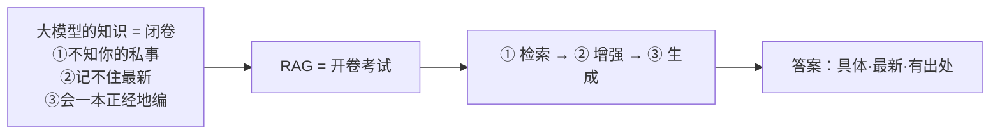

# K0 · 小结与自测

## 一图回顾

一句话收束：大模型的知识是「闭卷」的——有限、过时、无法溯源。RAG 不改模型，只在作答前多做一步「检索」，把闭卷改成开卷：**检索**找出相关资料、**增强**拼进提问、**生成**照着答并标出处。三个先天缺陷，一招填平。

## 要点回顾

| 小节 | 两行版 |
| --- | --- |
| [K0.1 三个先天缺陷](./01-three-flaws.mdx) | 不知你的私事、记不住最新、会编——病根是知识被固化在参数里；重训/微调又慢又贵还无出处 |
| [K0.2 RAG：开卷考试](./02-what-is-rag.mdx) | 检索→增强→生成，知识留在外部随查随用；便宜、灵活、可溯源，是企业级 AI 的标配 |

## 综合自测

<Quiz questions={[
  {
    q: '下面哪个问题，最适合用 RAG 而不是「直接问大模型」来解决？',
    options: [
      '帮我把这段话翻译成英文',
      '我们公司上个月刚更新的差旅报销标准是多少',
      '写一首关于春天的诗',
      '解释一下什么是牛顿第二定律',
    ],
    answer: 1,
    explanation: '「上个月刚更新的公司标准」同时踩中「私有」和「最新」两个坑——模型训练数据里没有、也无法溯源，正是 RAG 的主场。翻译、写诗、讲通用物理都在模型的通用能力范围内，不需要外挂知识。',
  },
  {
    q: '大模型的三个先天缺陷（不知私事、记不住最新、会编），它们共同的病根是什么？',
    options: [
      '模型太小',
      '知识被固化在参数里——训练时背下的那些，既有限、又过时、还无法翻书核对',
      '中文语料太少',
      '用户提问方式不对',
    ],
    answer: 1,
    explanation: '三个缺陷表现不同，根子是同一个：知识全靠训练时塞进参数，是「闭卷」的。有限（放不下所有）、过时（停在训练截止）、不可溯源（化成了数字）。RAG 把知识挪到模型外部、用时检索，正是对症下药。',
  },
  {
    q: 'RAG 流水线里，「增强（Augmented）」这一步具体在做什么？',
    options: [
      '让模型的参数变多',
      '把检索到的资料拼进给模型的提问里，一起送进上下文',
      '增强模型的推理能力',
      '把知识训练进模型',
    ],
    answer: 1,
    explanation: '「增强」指的是用检索来的资料增强模型的「上下文」——把资料和问题拼成一个提示词一起给模型。它既不改参数，也不训练模型，只是把参考资料摆到模型眼前。',
  },
  {
    q: '为什么说 RAG 和「微调模型」不是二选一，而是常常并用？',
    options: [
      '因为两者是同一种技术',
      '因为微调擅长教「怎么说」（行为、风格、格式），RAG 擅长供「说什么」（事实、私有、最新知识）——分工不同',
      '因为 RAG 必须先微调才能用',
      '因为微调比 RAG 便宜',
    ],
    answer: 1,
    explanation: '微调改变的是模型的行为和风格（怎么说话、遵循什么格式），RAG 提供的是新鲜的事实知识（说什么内容）。生产系统常常微调调语气、RAG 供内容，两条腿走路。把它俩对立起来是常见误区。',
  },
  {
    q: '关于 RAG 的能力边界，哪个说法最准确？',
    options: [
      'RAG 能让模型回答任何问题',
      'RAG 只负责把对的资料递到模型面前——知识库里没有或检索没找到，照样答不好；它不能让模型凭空变聪明',
      'RAG 能完全消除幻觉',
      'RAG 会让模型变笨',
    ],
    answer: 1,
    explanation: 'RAG 是给模型配了本参考书，不是换了个脑子。检索不到、库里是错的，答案照样翻车（K6 会讲「检索没召回」是头号失败模式）；理解和推理仍是模型自己的事。它让答对变得可能且容易，但不保证一定对。',
  },
  {
    q: '朴素 RAG（Naive RAG）只有「检索-拼接-生成」几行代码，中篇后面各章主要在做什么？',
    options: [
      '推翻 RAG，换用别的方法',
      '给这几行的每一步「打补丁」：怎么切块、怎么检索得准、怎么重排、怎么让答案有据、怎么评测',
      '把 RAG 训练进模型',
      '只讲理论不讲实现',
    ],
    answer: 1,
    explanation: '朴素 RAG 能跑但在生产里处处翻车。K2 补切块、K1/K3/K4 补检索与重排、K5 补有据生成、K6 补评测、K7 补进阶——整条中篇就是沿着「检索→增强→生成」这三步，把每一步做扎实。',
  },
]} />

下一章 [K1 · 语义检索](../01-semantic-search/index.md)：把「检索」这一步拆到底——模型怎么「按意思」而不是「按字」找资料。
