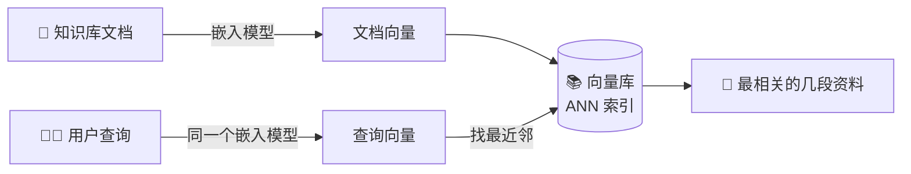

# K1 · 小结与自测

## 一图回顾

一句话收束：语义检索把「按意思找」变成了「找最近的向量」。**嵌入模型**负责把查询和资料都变成向量（意思相近→坐标相近），**向量数据库**负责在海量向量里用近似最近邻**秒级找出最近的几个**。前者决定「找得准不准」，后者决定「找得快不快」。

## 要点回顾

| 小节 | 两行版 |
| --- | --- |
| [K1.1 从对字到对意思](./01-from-keyword-to-semantic.mdx) | 关键词检索两死穴（同义不同字、一词多义）；语义检索把意思变坐标，用余弦相似度找最近的点；但精确匹配是关键词的主场 |
| [K1.2 向量数据库](./02-vector-db.mdx) | 库大到几百万段时线性扫描太慢；向量库靠近似最近邻（ANN）用一点点精度换巨大速度；库快≠结果准 |

## 综合自测

<Quiz questions={[
  {
    q: '关键词检索（BM25）拿来做 RAG，两个死穴是什么？',
    options: [
      '太慢、太占内存',
      '同义不同字找不到（换个说法就漏）、一词多义分不清（如「苹果」是水果还是手机）',
      '只能处理英文、不能排序',
      '需要向量数据库支持',
    ],
    answer: 1,
    explanation: '关键词检索只会「对字」：用户换种说法（「不想要了」对「退货」）它就漏；碰到多义词（「苹果」）它分不清语境。这两个死穴正是语义检索要解决的。',
  },
  {
    q: '语义检索为什么能命中「字面完全不同、意思却一样」的资料？',
    options: [
      '因为它会自动翻译',
      '因为它把查询和资料都变成向量，意思相近则坐标相近，检索变成了「找坐标最近的点」',
      '因为它背下了所有同义词',
      '因为它逐字比对',
    ],
    answer: 1,
    explanation: '回扣上篇「意思相近→向量相近」。变成向量后，「买的东西不想要了」和「七天无理由退换」坐标几乎重合，所以跨过字面差异也能对上——这就是语义检索的核心。',
  },
  {
    q: '为什么语义检索普遍采用「双编码器」（查询和文档各自独立编码）架构？',
    options: [
      '因为它精度最高',
      '因为文档向量可以离线预先算好存库里，查询时只需实时编码一个短句——这才扛得住亿级检索',
      '因为它不需要嵌入模型',
      '因为它能处理图片',
    ],
    answer: 1,
    explanation: '双编码器把「编码」和「比对」解耦：文档向量离线算好入库，检索时只算查询这一个短句。若查询和文档必须成对一起过模型（交叉编码器），亿级文档每次都要重算，根本跑不动。精度更高的交叉编码器只能用在小范围重排（K4）。',
  },
  {
    q: '「近似最近邻（ANN）」相比「线性扫描」，本质上做了什么取舍？',
    options: [
      '用更多内存换更准的结果',
      '允许偶尔漏掉真正最近的那个、返回「几乎最近」的，以此换来快几个数量级的速度',
      '牺牲速度换取绝对精确',
      '只是换了个数据库',
    ],
    answer: 1,
    explanation: 'ANN 放弃「保证绝对最近」，只求「几乎最近」，把每次查询的比对从几百万次降到几十次。对返回多段的 RAG 来说这个近似几乎无损——和上篇量化「用精度换效率」是同一种工程哲学。',
  },
  {
    q: '余弦相似度衡量的是什么？为什么用它而不用直线距离？',
    options: [
      '衡量向量长度差；因为长度更重要',
      '衡量两个向量的方向有多接近；因为它只看方向不看长度，能忽略「同一句话说三遍」这类长度噪声',
      '衡量向量的维度数；因为维度决定相似度',
      '衡量两个词的字面重合度',
    ],
    answer: 1,
    explanation: '余弦相似度看的是两个向量的夹角（方向），越接近 1 越同向、意思越像。它忽略长度，所以「一段话重复几遍」不影响相似度——只抓语义方向。归一化后，余弦相似度就等于点积。',
  },
  {
    q: '「我们上了最快的向量数据库，RAG 检索质量应该就没问题了」——这话错在哪？',
    options: [
      '没错，向量库越快越好',
      '向量库只负责「快速找相似向量」，找得准不准取决于嵌入模型和切块质量——库快不等于结果好',
      '应该追求最慢的向量库',
      '向量库和检索质量完全无关',
    ],
    answer: 1,
    explanation: '向量库解决的是「快」，不是「准」。若嵌入模型选得差、切块切得烂，喂进去的是坏向量，捞出来的也是坏结果。「检索快」和「检索好」是两回事——这也引出下一章：切块（K2）同样决定成败。',
  },
]} />

下一章 [K2 · 切块的艺术](../02-chunking/index.md)：语义检索找的是「段」，而一份 50 页的手册怎么切成可检索的段——切错了，再好的检索也白搭。
