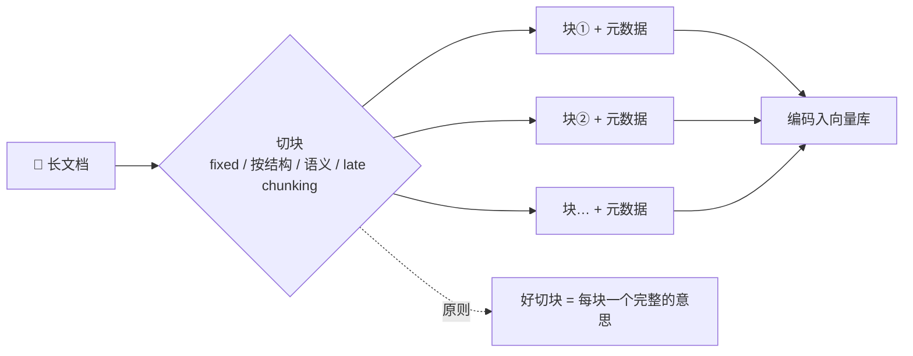

# K2 · 小结与自测

## 一图回顾

一句话收束：切块是 RAG 里最不起眼、却最容易翻车的一步。**切太大**，一块塞太多事，重点被稀释、相似度被拉平；**切太小**，一个完整的事实被边界拦腰截断，只捞回半个答案。好切块的唯一标准，是让**每一块 = 一个完整的意思**——语义切块、滑窗、late chunking，都是在为这一个目标服务。

## 要点回顾

| 小节 | 两行版 |
| --- | --- |
| [K2.1 为什么要切、怎么切坏](./01-why-chunk.mdx) | 整篇检索稀释重点、一个向量装不下细节，所以要切块；切太大命中不干净，切太小事实被切断；chunk size 和 overlap 要拿真实查询调 |
| [K2.2 更聪明的切法](./02-smart-chunking.mdx) | 语义切块在话题断崖处下刀、滑窗检索小块生成大块、late chunking 先编码整篇再切；别追新，够用就好 |

## 综合自测

<Quiz questions={[
  {
    q: '为什么长文档不能整篇存进知识库、整篇拿去检索？',
    options: [
      '因为存储空间不够',
      '因为整篇检索会稀释重点、浪费上下文，而且把整篇压成一个向量会糊掉全部细节、检索不精准',
      '因为模型读不了长文',
      '因为长文档无法编码',
    ],
    answer: 1,
    explanation: '两个硬约束：要给模型精准的一段而非整本手册（否则重点被埋、成本高），以及一个向量装不下整篇的具体细节（回扣上篇 1.4）。所以必须切块，每块单独编码入库。',
  },
  {
    q: '「切太大」会带来的主要问题是？',
    options: [
      '一个完整的事实被切断',
      '一块里塞太多不同的事，检索命中也不干净、噪声多，而且内容太杂让向量被「平均」得相似度反而拉低',
      '检索速度变快',
      '向量维度变高',
    ],
    answer: 1,
    explanation: '大块的坑是「杂」：命中了也混着无关内容稀释重点，且一块讲太多事时它的向量谁都不太像、相似度被拉平。「事实被切断」是切太小的坑，不是切太大的。',
  },
  {
    q: '「重叠（overlap）」在固定大小切块里起什么作用？',
    options: [
      '让块变得更大',
      '相邻块之间留一段重复内容，给正好压在边界上的句子打「补丁」，减少完整事实被切断',
      '加快检索速度',
      '减少存储占用',
    ],
    answer: 1,
    explanation: 'overlap 让边界处的句子在相邻两块里各有一份完整拷贝，检索到哪块都不缺——代价是存储冗余。它专治「固定切块正好切在句子中间」的边界截断问题，典型取块大小的 10%~20%。',
  },
  {
    q: '实验里「每句一小块」在一个查询上答错、在另一个查询上答对，这说明切块的好坏取决于什么？',
    options: [
      '取决于块的大小，越大越好',
      '取决于有没有把一个完整的事实切断——切太碎不是永远错，只在事实跨越块边界时才致命',
      '取决于检索算法',
      '取决于文档的长度',
    ],
    answer: 1,
    explanation: '「不能退什么」需要跨句的时长+例外，切碎就断了（错）；「运费」本就在一句里，切碎也没断（对）。可见判断标准不是块大小本身，而是完整的意思有没有被切散。',
  },
  {
    q: '关于「语义切块 / late chunking 等进阶切法」，正确的态度是？',
    options: [
      '越新越好，一律优先采用',
      '它们在文档结构复杂、跨段事实多时才显价值；简单场景用固定切块 + overlap 往往够用且最省事，应先跑通再按评测针对性升级',
      '它们能替代所有其他步骤',
      '它们不需要评测',
    ],
    answer: 1,
    explanation: '进阶切法不是万能升级。为简单 FAQ 上 late chunking 是杀鸡用牛刀。正确顺序：先用最简单的切法跑通，用 K6 评测量出短板，再针对性换更聪明的切法——记原理胜过追方法名。',
  },
  {
    q: '为什么切块要「评测驱动地调参」，而不是拍脑袋定一个 chunk size？',
    options: [
      '因为评测很好玩',
      '因为最优切法高度依赖文档类型和查询类型，没有万能最优解——只有拿真实的问答集测不同配置，才能选出适合你数据的切法',
      '因为评测能让模型更聪明',
      '因为 chunk size 必须是整数',
    ],
    answer: 1,
    explanation: '手册、对话、代码、表格各有各的最佳切法，问细节和问概括需要的块大小也不同。chunk size、overlap、切法都该拿真实查询去测（K6 的方法），用命中率和答对率来选——切块调参是 RAG 里投入产出比最高的环节之一。',
  },
]} />

下一章 [K3 · 三种找法](../03-retrieval-methods/index.md)：关键词、向量、混合——把两种找法的长处拧成一股绳（建设中）。
