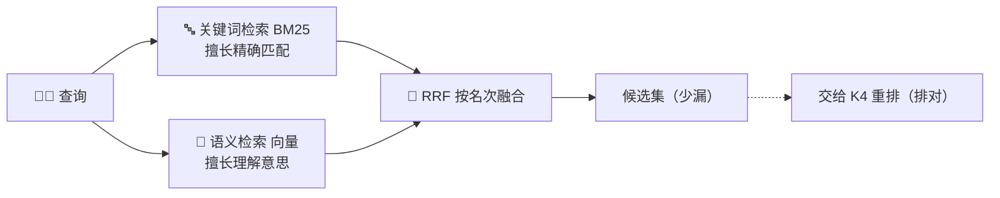

# K3 · 小结与自测

## 一图回顾

一句话收束：没有一路检索是全能的——**关键词**精确、**语义**懂意思，各有盲区。生产 RAG 用**混合检索**把两路一起上，靠 **RRF「只看名次」**绕开分数不可比的难题，尽量少漏；漏得最少之后，再交给下一章的重排排对。

## 要点回顾

| 小节 | 两行版 |
| --- | --- |
| [K3.1 关键词检索](./01-keyword-search.mdx) | BM25 的主场是精确匹配（型号/编号/专名）；打分直觉=词频高加分、太普通降权；但它不懂同义词 |
| [K3.2 混合检索与 RRF](./02-hybrid-search.mdx) | 两路一起跑、各补盲区；RRF 只看名次不看分数，绕开刻度不可比；救不了库里没答案 |

## 综合自测

<Quiz questions={[
  {
    q: '下面哪个场景，你应该更依赖关键词检索（BM25）而不是纯语义检索？',
    options: [
      '用户用大白话问一个日常问题',
      '用户搜精确的产品型号「X9-2000」或订单号',
      '用户问「这两段话意思像不像」',
      '用户的提问和文档用词完全不同',
    ],
    answer: 1,
    explanation: '精确型号、编号要的是一字不差，是关键词检索的主场；语义检索会把 X9-2000 和 X9-3000 混起来。其余三个都是「意思」层面的匹配，是语义检索的强项。',
  },
  {
    q: 'BM25 打分时，为什么「的」「和」这类词命中几乎不加分？',
    options: [
      '因为它们太短',
      '因为它们在整个知识库里到处都是（逆文档频率极低），命中不说明任何相关性',
      '因为 BM25 会忽略所有虚词',
      '因为它们没有意义',
    ],
    answer: 1,
    explanation: 'BM25 靠逆文档频率（IDF）给词加权：一个词在全库越罕见越值钱、越常见越不值钱。「的」到处都有，命中它毫无区分度；而「陪产假」这种罕见词命中，才是强信号。',
  },
  {
    q: '为什么纯语义检索容易漏掉「X9-2000」这样的精确型号？',
    options: [
      '因为它不支持数字',
      '因为嵌入把 X9-2000 和 X9-3000 编码成了几乎相同的向量——语义上像，但你要的偏偏是精确那一个',
      '因为向量库太小',
      '因为型号太长',
    ],
    answer: 1,
    explanation: '语义检索追求「意思相近」，会把同系列型号的向量压得很近，精确差别被模糊掉。这正是它和关键词检索互补的原因——精确匹配交给关键词。',
  },
  {
    q: '「混合检索」为什么比单用任何一路都更少漏？',
    options: [
      '因为它用了更大的模型',
      '因为关键词和语义各有盲区，两路一起跑能各补对方照不到的角落——一路会漏的，另一路补上',
      '因为它检索了两遍所以更慢但更准',
      '因为它随机组合结果',
    ],
    answer: 1,
    explanation: '关键词漏掉「换了说法」的，语义漏掉「精确词」的，跨话题查询单路还会只顾一半。混合把两路的视野叠起来，覆盖面最广、漏得最少——这就是它成为生产标配的原因。',
  },
  {
    q: 'RRF 融合两路结果时「只看名次不看分数」，主要为了解决什么问题？',
    options: [
      '为了让检索更快',
      '为了绕开「BM25 分和相似度刻度不同、没法直接相加」的难题——名次是两路通用的货币',
      '为了随机打乱结果',
      '为了只保留第一名',
    ],
    answer: 1,
    explanation: '关键词给的是 BM25 分、语义给的是相似度，两把尺子刻度不同，硬加无意义、归一化又对异常分数敏感。RRF 把两路都翻译成「排第几名」这个通用货币，直接相加，简单又鲁棒。',
  },
  {
    q: '关于混合检索的能力边界，哪个说法最准确？',
    options: [
      '混合检索能保证找到任何问题的答案',
      '它只能在已有资料里尽量捞全——知识库里根本没有或写错了，两路一起上也变不出正确答案',
      '有了混合检索就不需要重排了',
      '混合检索能自动纠正知识库里的错误',
    ],
    answer: 1,
    explanation: '混合检索提升的是召回率（别漏），但它救不了「库里没有答案」——检索技术再花哨也盖不过知识库本身的质量（回扣 K0）。而且它负责「别漏」，还需要 K4 的重排来「排对」。',
  },
]} />

下一章 [K4 · 重排](../04-reranking/index.md)：混合检索把该捞的都捞回来了，但「捞回来」不等于「排对了」——重排负责把最该看的顶到最前。
