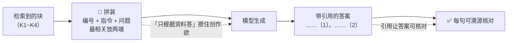

# K5 · 小结与自测

## 一图回顾

一句话收束：前面的检索做得再好，也要靠**拼装**和**引用**把好料变成好答案——拼装决定模型「看到什么」（编号列好、指令定死、最相关放首尾），引用决定答案「信不信得过」（每句标出处、可核对）。但记住：**有引用不等于正确，可核对不等于已核对**。

## 要点回顾

| 小节 | 两行版 |
| --- | --- |
| [K5.1 上下文拼装](./01-context-assembly.mdx) | 把块编号列好、配明确指令、问题放末尾；三坑：放太多块、lost in the middle（最相关放首尾）、指令不明确 |
| [K5.2 有据回答](./02-grounding-citation.mdx) | 指令摁住创作欲 + 引用给每句标出处；引用是最硬底气，但有引用≠正确（引用幻觉、忠实复述错料） |

## 综合自测

<Quiz questions={[
  {
    q: '「上下文拼装」和「有据回答」分别解决什么问题？',
    options: [
      '拼装解决检索速度，有据回答解决切块',
      '拼装决定模型「看到什么」（把资料摆好），有据回答决定答案「信不信得过」（逼它照料答、标出处）',
      '两者都是训练模型的方法',
      '两者都只和向量数据库有关',
    ],
    answer: 1,
    explanation: '拼装是「把料摆好」——编号、指令、顺序，决定模型看到什么；有据回答是「逼它照料答」——用指令摁住创作欲、用引用让答案可核对。前者管输入，后者管输出的可信度。',
  },
  {
    q: '受「lost in the middle」现象启发，拼装时最相关的检索块应该放在哪里？',
    options: ['正中间', '上下文的最前面和最后面', '随机位置', '全部删掉'],
    answer: 1,
    explanation: '2023 年研究发现模型对上下文首尾更敏感、容易忽略中段。所以把最相关的证据放在开头和结尾，把次要的放中间，用位置对冲「中间盲区」。',
  },
  {
    q: '关于「检索块放多少」，正确的做法是？',
    options: [
      '越多越好，命中的全塞进去',
      '少而精：块太多会稀释重点、拖慢速度、烧钱，还可能让关键信息掉进中间盲区',
      '固定放 10 个',
      '和效果无关，随意',
    ],
    answer: 1,
    explanation: '「多多益善」是错觉。塞满上下文会稀释重点、增加成本、触发 lost in the middle。靠重排选出少而精的几块，比一股脑全塞更好。',
  },
  {
    q: '有据回答（grounding）靠哪两个抓手实现？',
    options: [
      '更大的模型 + 更多的数据',
      '明确指令（只根据资料答、没有就说没有）+ 引用标注（每句标来源、可核对）',
      '加快检索 + 扩大知识库',
      '微调 + 量化',
    ],
    answer: 1,
    explanation: '一软一硬：指令把模型从「作家模式」切到「摘录员模式」，摁住它掺记忆的冲动；引用要求每句话标出处，让答案可被核对。两者配合，才能做到「答必有据」。',
  },
  {
    q: '为什么说引用是 RAG 相对「凭记忆瞎答」最硬的底气？',
    options: [
      '因为引用让回答更长',
      '因为它把答案从「你信不信我」变成「你可以自己查」，给了可被验证的锚点——对错不起的场景是刚需',
      '因为引用能消除所有幻觉',
      '因为引用能提高模型参数量',
    ],
    answer: 1,
    explanation: '不能溯源的答案在企业、医疗、法律场景约等于不能用。引用给每句话一个可核对的出处，让答案有了验证锚点。这正好填平了 K0 的缺陷三（会一本正经地编、还无法溯源）。',
  },
  {
    q: '一个 RAG 答案句句都带了引用〔1〕〔2〕，下列哪个判断最准确？',
    options: [
      '答案一定正确，可直接采信',
      '有引用让答案「可核对」，但不保证正确——可能引用幻觉（标了来源原文却没这句），也可能忠实复述了知识库里本身就错的资料',
      '有引用说明模型没有幻觉',
      '引用只是排版，无实际意义',
    ],
    answer: 1,
    explanation: '「有引用」和「正确」是两回事。模型可能编了内容还编个出处（引用幻觉），或忠实复述了错误资料（垃圾进垃圾出）。引用让核对成为可能，但核对本身还得靠人或评测——这正引出 K6。',
  },
]} />

下一章 [K6 · 评测](../06-evaluation/index.md)：有了能跑、能引用的 RAG，怎么系统地知道它到底准不准——RAG 三元组与三大失败模式。
