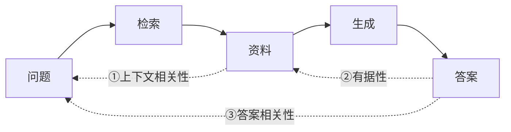

# K6.1 RAG 三元组：给系统做体检的三盏灯

## 一个坏答案，锅在谁？

用户问「退货运费谁承担」，你的 RAG 答了句错的。是检索没找对资料？还是资料对了、模型没照着用？还是照着用了、却复述走样？

**分不清病根，就没法对症下药。** 你可能花一整天优化检索，结果病根在生成——白忙。RAG 是一条流水线（检索 → 增强 → 生成），要给它做体检，就得在每个关节上装一个探头。这三个探头，业界叫 <Term id="rag-triad">RAG 三元组</Term>。

## 三盏灯，对应三个问题

RAG 三元组是三个「参照检索资料就能判断、不需要标准答案」的检查项，正好卡在流水线的三个关节上：

1. **<Term id="context-relevance">上下文相关性</Term>**：检索回来的资料，和问题**相关吗**？——管的是「检索这一步做得好不好」（K1~K4 的活）。资料都不对，后面全白搭。
2. **<Term id="groundedness">有据性</Term>**（也叫忠实度）：答案里的每句话，都由资料**支撑吗**？——管的是「模型有没有老实照着资料答」（K5 的活）。这是查幻觉的主力探头。
3. **<Term id="answer-relevance">答案相关性</Term>**：答案有没有**正面回答**用户的问题？——资料对、也有据，但答非所问，照样是失败。

**关键在于它们串成了一条诊断链**：哪盏灯先红，病根就在哪个环节。亲手体检一遍：

<FailureDiagnoser />

## 为什么是「三个」而不是「一个总分」

你可能会想：直接给答案打个「好不好」的总分不就行了？

不行——**总分能告诉你「病了」，却不告诉你「病在哪」**。一个 60 分的 RAG，可能是检索烂（上下文相关性红）、也可能是检索好但模型乱编（有据性红），两者的药方南辕北辙。三元组把「好不好」拆成三个可独立诊断的关节，你才能精准定位：

- 上下文相关性红 → 去修**检索**（换嵌入模型、调切块、加混合检索和重排，K1~K4）；
- 有据性红 → 去修**生成**（收紧提示词指令、强制引用，K5）；
- 答案相关性红、但前两个绿 → 检索和忠实都没问题，是模型**没理解问题**或答偏了（改提示、澄清问题）。

这就是评测的真正价值：不是打个分了事，而是**把「哪里坏了」量化出来，指导你该修哪儿**。

:::caution 三盏灯是怎么「判定」的？
你可能好奇：谁来判断「资料相不相关」「答案有没有据」？现实中最常用的办法是<b>让另一个大模型当裁判</b>（LLM-as-judge）——把问题、资料、答案喂给它，让它逐项打分。这又快又便宜，但要警惕它自带的偏差（上篇 [7.2 节](/docs/evaluation/pitfalls)讲过：偏爱长答案、偏爱自信语气）。所以严肃评测里，模型裁判要配上一部分人工校验、要固定评分标准、还要防止评测集本身被污染（上篇 [7.2](/docs/evaluation/pitfalls)）。三盏灯给了你诊断的框架，但「怎么让灯判得准」本身也是门功夫。
:::

<DeepDive title="三元组的形式化与评测框架">

**三个指标的操作化定义**（都是「参照式、无需标准答案」的评估）：

- **上下文相关性**：检索到的每个块，有多大比例是回答问题真正需要的？（衡量检索的信噪比——捞回一堆无关块会拉低它）
- **有据性 / 忠实度**：把答案拆成一个个论断，每个论断能在检索资料里找到支撑吗？支撑的比例就是有据性分。（这是幻觉检测的核心，回扣 [K5.2](../05-generation/02-grounding-citation.mdx)）
- **答案相关性**：答案有多直接地回应了问题本身？（防「正确但跑题」——比如答了一堆相关背景却没给出用户要的那个数）

**为什么叫「三元组」**：这三个指标恰好覆盖了 RAG 三个组件两两之间的关系——问题↔资料（检索质量）、资料↔答案（生成忠实）、问题↔答案（整体有用）。任何一条边断了，最终答案就不可信。

**带数字走一遍。** 拿一条真实样本给三盏灯打分（分数取 0~1，是「达标比例」的直觉）：

> - 问题：「会员退货要付运费吗？」
> - 检索到 3 个块：`运费规则`（相关）、`退货政策`（沾边）、`配送时效`（无关）。
> - 答案：「会员退货免运费，非会员自付 10 元。〔运费规则〕」

逐项打分：

| 指标 | 怎么算 | 分数 |
| --- | --- | --- |
| 上下文相关性 | 3 个块里 2 个和问题相关（运费规则强相关、退货政策沾边），1 个无关 | ≈ 0.67 |
| 有据性 | 答案的 2 个论断（会员免、非会员付 10 元）都能在「运费规则」原文找到支撑 | 1.0 |
| 答案相关性 | 正面回答了「要不要付运费」 | 1.0 |

**判定**：有据性和答案相关性满分、上下文相关性偏低——系统是「健康的」，但检索捞回了 1 个无关块（配送时效），信噪比有提升空间（把召回精度或重排调一调，能进一步把上下文相关性推高）。这就是三盏灯的用法：不是一个笼统的「好/坏」，而是**逐环打分、指出下一步该优化哪里**。

**评测框架**（2024-2026 生态）：RAGAS、TruLens、DeepEval 等开源框架把这三个指标（及更多，如答案正确性、上下文召回率）自动化了，大多用 LLM-as-judge 实现。工程上还要区分两类评测：

- **检索评测**（不看生成）：召回率（该找的找回来没有）、精度、命中率（K4 的召回率优先在这里量化）；
- **端到端评测**（看最终答案）：三元组 + 答案正确性。

两类要分开测——检索评测告诉你「检索这一环好不好」，端到端告诉你「整个系统好不好」。混在一起就又回到了「只有总分、不知病根」的困境。

**评测集从哪来**：理想是真实用户问题 + 人工标注的黄金答案；实践中常用「让模型根据知识库自动生成问答对」来冷启动，再逐步补充线上真实失败案例（回扣下篇 [A7 评测驱动开发](/agents/agent-evaluation/eval-driven)的思路——评测集要保鲜，别过拟合）。

</DeepDive>

## 小结

:::tip 本节要点
- **RAG 三元组**是给 RAG 做体检的三盏灯：上下文相关性（检索对不对）、有据性（答案有没有依据）、答案相关性（有没有答到点）。
- 三盏灯串成诊断链——哪盏先红，病根就在哪个环节，指导你该修检索还是修生成。
- 拆成三个而非一个总分，是因为总分只说「病了」、不说「病在哪」，没法对症下药。
- 三盏灯常用 LLM-as-judge 来判，但要警惕裁判自带的偏差（回扣上篇 7.2）。
:::

<Quiz questions={[
  {
    q: 'RAG 三元组的三个指标，分别管流水线的哪个环节？',
    options: [
      '全都管生成这一步',
      '上下文相关性管检索、有据性管生成是否照资料答、答案相关性管有没有答到点',
      '分别管切块、嵌入、排序',
      '三个指标其实是一回事',
    ],
    answer: 1,
    explanation: '上下文相关性卡在「问题↔资料」（检索质量）、有据性卡在「资料↔答案」（生成忠实）、答案相关性卡在「问题↔答案」（整体有用）。三盏灯对应三个关节，哪盏红就知道去修哪一环。',
  },
  {
    q: '为什么用「三个指标」而不是「一个好不好的总分」来评测 RAG？',
    options: [
      '三个指标算起来更快',
      '因为总分只能告诉你「病了」、不能告诉你「病在哪」——检索烂和模型乱编的药方完全不同',
      '因为总分不够精确',
      '因为业界规定必须用三个',
    ],
    answer: 1,
    explanation: '一个 60 分的 RAG，可能是检索没找对（修检索），也可能是检索好但模型乱编（修生成）。总分分不清这两者，三元组把「好不好」拆成可独立诊断的关节，才能精准定位该修哪儿。',
  },
  {
    q: '一个 RAG 系统：检索回来的资料确实相关、答案也确实由资料支撑，但用户问「A 多少钱」它答了一堆 A 的背景介绍就是没说价格。哪盏灯会红？',
    options: [
      '上下文相关性',
      '有据性',
      '答案相关性',
      '三盏灯都绿',
    ],
    answer: 2,
    explanation: '资料相关（上下文相关性绿）、答案有据（有据性绿），但答非所问——没正面回答「多少钱」，答案相关性红。这说明「资料对、也忠实」还不够，答案还得真正回应问题。',
  },
]} />

## 延伸阅读

- [RAGAS（2023）](https://arxiv.org/abs/2309.15217)——把 RAG 三元组等指标自动化的开源评测框架，参照式无需标准答案。
- [TruLens 的 RAG 三元组](https://www.trulens.org/getting_started/core_concepts/rag_triad/)——这个概念的通俗出处。
- 下一节 [K6.2 三大失败模式](./02-failure-modes.mdx)：把三盏灯对应到三种具体病根，逐个拆解怎么修。
