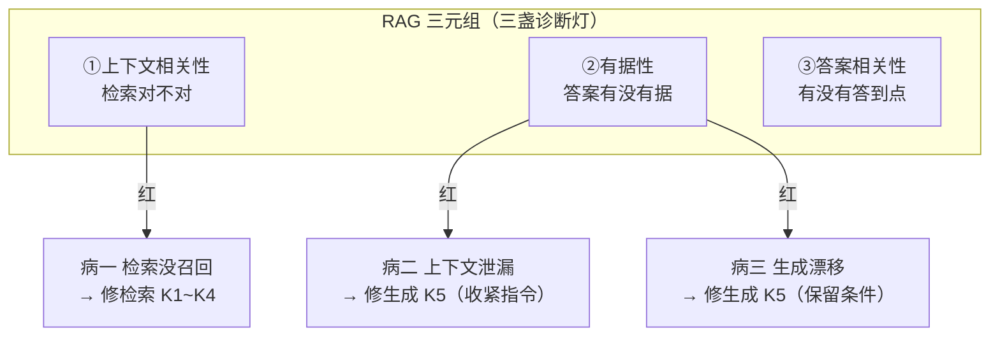

# K6 · 小结与自测

## 一图回顾

一句话收束：RAG 好不好是**体检出来的，不是感觉出来的**。三元组三盏灯（上下文相关性、有据性、答案相关性）卡在流水线三个关节上，哪盏先红就知道病根在检索还是生成；三大失败模式（没召回 / 上下文泄漏 / 生成漂移）各有各的药方。先量化病根、再对症下药，别凭手感瞎调。

## 要点回顾

| 小节 | 两行版 |
| --- | --- |
| [K6.1 RAG 三元组](./01-rag-triad.mdx) | 三盏灯=上下文相关性/有据性/答案相关性，卡在三个关节；拆成三个而非总分，才能定位病在哪、指导修哪儿 |
| [K6.2 三大失败模式](./02-failure-modes.mdx) | 没召回（修检索、最致命）/ 泄漏（资料对但用旧记忆，修生成）/ 漂移（照答却丢条件，修生成）；一张诊断表对症下药 |

## 综合自测

<Quiz questions={[
  {
    q: 'RAG 三元组是哪三个指标？',
    options: [
      '速度、成本、准确率',
      '上下文相关性、有据性、答案相关性',
      '召回率、精度、F1',
      '切块、检索、生成',
    ],
    answer: 1,
    explanation: '上下文相关性（检索的资料相不相关）、有据性/忠实度（答案有没有被资料支撑）、答案相关性（有没有正面回答问题）。三者分别卡在问题↔资料、资料↔答案、问题↔答案三条边上。',
  },
  {
    q: 'RAG 评测为什么要「检索评测」和「端到端评测」分开做？',
    options: [
      '为了跑得更快',
      '因为检索评测告诉你「检索这一环好不好」、端到端告诉你「整个系统好不好」，混在一起又会退回「只有总分、不知病根」',
      '因为两者用不同的模型',
      '其实不用分开',
    ],
    answer: 1,
    explanation: '检索评测（召回率、命中率）只看检索这一环，端到端评测（三元组、答案正确性）看最终答案。分开测才能定位是检索的锅还是生成的锅——这正是三元组「拆开诊断」思路的延伸。',
  },
  {
    q: '「检索没召回」为什么是最致命的失败模式？',
    options: [
      '因为它最难发现',
      '因为它在流水线最前端，对的资料没捞回来，重排和生成都救不回来',
      '因为它会让成本暴涨',
      '因为它只在大知识库里出现',
    ],
    answer: 1,
    explanation: '检索是第一环。它漏了，下游拿到的就是烂牌——重排排不出没召回的、生成照不了不存在的。所以召回阶段要宁滥勿缺，尽量别漏。',
  },
  {
    q: '检索对、答案却和资料矛盾（用了旧记忆），是哪种失败？哪盏灯红？',
    options: [
      '检索没召回；上下文相关性红',
      '上下文泄漏；有据性红',
      '生成漂移；答案相关性红',
      '健康；没有灯红',
    ],
    answer: 1,
    explanation: '上下文相关性绿（检索对了），但答案脱离资料、和它矛盾——有据性红。这是「上下文泄漏」：模型的旧记忆盖过了眼前资料，病根在生成，药方是收紧指令、强制引用。',
  },
  {
    q: '「生成漂移」最阴险的地方在于？',
    options: [
      '它会让系统崩溃',
      '答案看起来通顺、大方向也对，但悄悄丢了关键条件（如「非会员要付钱」），用户很难发现',
      '它总是很明显',
      '它只影响长文档',
    ],
    answer: 1,
    explanation: '生成漂移是「照着答但复述走样」——模型把「会员免、非会员付」概括成「一律免」，答案通顺、方向对，却少了个致命条件。正因为它不像瞎编那样露骨，反而更难被用户察觉，要靠有据性评测专门盯。',
  },
  {
    q: '评测驱动的 RAG 迭代，正确的闭环是？',
    options: [
      '凭手感调参数，效果好就行',
      '建评测集 → 跑三元组 → 按失败模式分桶 → 找占比最大的桶针对性优化 → 回归重跑',
      '只优化检索，不管生成',
      '每次都把三个环节全重做',
    ],
    answer: 1,
    explanation: '和下篇智能体的评测驱动开发是同一套：先量化各类失败的占比（多少是检索的锅、多少是生成的锅），把资源投到占比最大的病根上，改完回归验证。这样每一步优化都有数据支撑，而不是凭感觉瞎调。',
  },
]} />

下一章 [K7 · 进阶与前沿](../07-frontier/index.md)：GraphRAG 多跳、Agentic RAG、以及 2026 年「RAG vs 长上下文」的真相。
