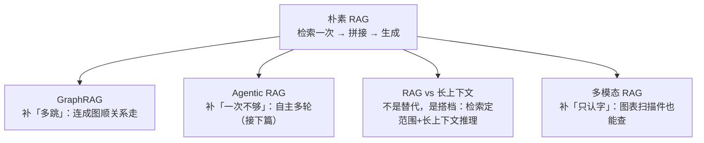

# K7 · 小结与自测

## 一图回顾

一句话收束：四个前沿方向，都在补朴素 RAG 的一块短板——GraphRAG 补「多跳推理」、Agentic RAG 补「查一次不够」、长上下文是搭档不是对手、多模态补「只认字」。但**没有一个是无脑升级**：GraphRAG 建图贵、Agentic 更慢更贵、长上下文有甜区、多模态还不够稳——用哪个，都要看你的问题类型。

## 要点回顾

| 小节 | 两行版 |
| --- | --- |
| [K7.1 GraphRAG](./01-graphrag.mdx) | 多跳问题（张伟→技术部→李娜→王芳）单段检索捞不回中间跳；GraphRAG 连成图顺关系走，专治关系密集/多跳/全局，代价是建图贵 |
| [K7.2 Agentic RAG](./02-agentic-rag.mdx) | 把检索从「固定一步」升级成「模型自主使用的工具」，自己决定查几轮；=中篇检索+下篇循环，接下篇 A3.3；单跳别无脑上 |
| [K7.3 RAG vs 长上下文](./03-rag-vs-long-context.mdx) | 「长上下文杀死 RAG」被成本账证伪；2026 共识是混用（检索定范围+长上下文推理）；小库是长上下文甜区 |
| [K7.4 多模态 RAG](./04-multimodal-rag.mdx) | 让图表扫描件也能查：转文字（简单丢信息）vs 多模态向量（图文同空间）；幻觉带进图像，高风险要人工复核 |

## 综合自测

<Quiz questions={[
  {
    q: '「张伟的经理的助理是谁」这类多跳问题，为什么难倒普通 RAG、却能被 GraphRAG 解决？',
    options: [
      '因为 GraphRAG 用了更大的模型',
      '因为答案要串起多段、中间环节字面上和问题不像（相似检索捞不回来）；GraphRAG 把资料连成关系图，顺着关系边一跳跳走就到了',
      '因为普通 RAG 不支持中文',
      '因为 GraphRAG 把知识库变小了',
    ],
    answer: 1,
    explanation: '多跳问题的中间环节（技术部的经理是李娜）字面上和问题不像，单段相似检索捞不回来。GraphRAG 把资料抽成「实体+关系」图谱，检索时顺着关系遍历（张伟—属于→技术部—经理→李娜—助理→王芳），把「找相似」升级成了「顺关系走」。',
  },
  {
    q: 'Agentic RAG 本质上是哪两样东西的结合？',
    options: [
      '大模型 + 小模型',
      '中篇的检索技术 + 下篇的智能体循环——让模型在「思考→行动→观察」里把检索当工具反复用',
      'GraphRAG + 长上下文',
      '微调 + RAG',
    ],
    answer: 1,
    explanation: 'Agentic RAG 把检索变成模型自主使用的工具，模型在循环里自己决定查什么、查几轮——这正是下篇智能体的思路。中篇的「怎么检索得准」+ 下篇的「怎么让模型自主行动」= Agentic RAG，三部曲在此交汇（接下篇 A3.3）。',
  },
  {
    q: '2026 年「RAG vs 长上下文」的真相是？',
    options: [
      '长上下文彻底取代了 RAG',
      '不是替代而是混用：用检索决定该看哪些资料、缩小到相关一小撮，再用长上下文在这一小撮上推理',
      'RAG 彻底取代了长上下文',
      '两者互相冲突无法共存',
    ],
    answer: 1,
    explanation: '「长上下文杀死 RAG」的预言被成本账证伪（全塞成本随库爆炸、超窗口、中间迷失、难更新）。2026 共识是搭档：检索精准定位、长上下文深度推理，各取所长。',
  },
  {
    q: '为什么长上下文（哪怕窗口再大）也替代不了 RAG？（选最完整的）',
    options: [
      '因为长上下文太贵',
      '因为四个结构性问题：成本随库线性爆炸、库总会超窗口、上下文越长越中间迷失、知识库要实时更新不能每次重塞',
      '因为长上下文不准',
      '因为 RAG 更快',
    ],
    answer: 1,
    explanation: '这四个是长上下文绕不开的死结：为整库付费太贵、窗口是硬上限、塞满≠用好（中间迷失）、以及知识要能实时更新。任意一个都让「全塞」在大库场景失效——这是 RAG 无法被替代的硬理由。',
  },
  {
    q: '多模态 RAG 的「多模态向量」路线，核心做法是什么？',
    options: [
      '把所有图片删掉只留文字',
      '用能同时理解图和文的嵌入模型（如 CLIP），把图片直接编码成向量、和文字放同一个空间，让图文可以互相检索',
      '把图片训练进模型',
      '给每张图配一个人工标签',
    ],
    answer: 1,
    explanation: '多模态向量路线用 CLIP 一类图文对比学习的模型，把图直接变成向量、和文字共处一个向量空间——用文字查图、用图查文都行，信息保留比「转成文字」更完整。这是比 OCR 转文字更强的路线。',
  },
  {
    q: '贯穿 K7 四个前沿方向的一条共同判断是什么？',
    options: [
      '越新的技术越好，应该总是用最前沿的',
      '每个前沿都在补朴素 RAG 的某块短板，但没有一个是无脑升级——用哪个都要看问题类型和代价',
      '朴素 RAG 已经被淘汰了',
      '前沿技术都不实用',
    ],
    answer: 1,
    explanation: 'GraphRAG 补多跳、Agentic 补「一次不够」、长上下文是搭档、多模态补「只认字」——但 GraphRAG 建图贵、Agentic 更慢、长上下文有甜区、多模态不够稳。和整个课程的态度一致：看清每个方案的代价与适用边界，按问题选，别为炫技上。',
  },
]} />

下一站 [附录 · 实战路线](../appendix/index.md)：中篇的最后一步——亲手用不到 100 行代码搭一个 RAG，把 K0~K6 串起来跑通。
