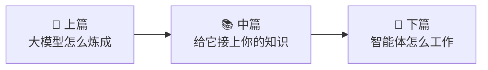

# 附录 · 实战路线

学完 RAG 的每一个零件，最好的收尾是**亲手搭一个**。这个附录给你四样东西：一段能跑的最小 RAG、一张选型地图、一份避坑清单，以及中篇的结语。

## 一、不到 100 行搭一个 RAG（不依赖任何框架）

中篇反复强调：RAG = 检索 + 增强 + 生成，框架只是把这三步包了层糖。下面这段代码把糖撕掉，让你看清骨头——它把 [K0~K5](../00-why-rag/index.md) 学的东西全串了起来。

:::tip 运行前提
需要 Python 3.10+、一个嵌入模型和一个对话模型（把接口换成你自己的即可——各家云服务、本地部署都行）。这段代码用于教学，省略了生产必需的持久化、批处理、错误处理和[评测](../06-evaluation/index.md)。
:::

```python
"""一个不依赖任何 RAG 框架的最小实现：切块 → 嵌入 → 检索 → 增强 → 生成。"""
import numpy as np
from openai import OpenAI

client = OpenAI(base_url="https://your-endpoint/v1", api_key="YOUR_KEY")
EMBED_MODEL = "your-embedding-model"
CHAT_MODEL = "your-chat-model"

# ---- 0. 你的知识库（真实场景是一堆文档，这里用几段话示意）----
DOCS = [
    "本店支持七天无理由退货，需保持包装完好，生鲜类除外。",
    "会员退货免运费由本店承担，非会员需自付 10 元退货运费。",
    "普通快递 3-5 天送达，偏远地区顺延；付费加急可次日达。",
    "黑卡会员享全场 95 折、专属客服和生日礼券。",
]

def embed(texts: list[str]) -> np.ndarray:
    """把文本变成向量（K1 语义检索的地基）。"""
    resp = client.embeddings.create(model=EMBED_MODEL, input=texts)
    return np.array([d.embedding for d in resp.data])

# ---- 1. 建库：切块 → 嵌入 → 存起来（离线做一次，K2 + K1）----
# 真实场景这里要按 K2 的策略切块；示意起见，一段话就是一个块
CHUNKS = DOCS
CHUNK_VECS = embed(CHUNKS)                      # 预先算好文档向量，检索时不用重算
CHUNK_VECS /= np.linalg.norm(CHUNK_VECS, axis=1, keepdims=True)  # 归一化，点积=余弦

# ---- 2. 检索：把问题变向量，找最相似的 k 段（K1 语义检索）----
def retrieve(question: str, k: int = 2) -> list[str]:
    qv = embed([question])[0]
    qv /= np.linalg.norm(qv)
    sims = CHUNK_VECS @ qv                       # 余弦相似度（K1 深入层）
    top = np.argsort(sims)[::-1][:k]             # 取最相似的 k 个
    return [CHUNKS[i] for i in top]
    # 进阶：这里可换成混合检索（K3）+ 重排（K4），检索质量会明显提升

# ---- 3. 增强 + 生成：拼进提示词，让模型照着答、标出处（K5）----
def rag(question: str) -> str:
    chunks = retrieve(question)
    context = "\n".join(f"[{i+1}] {c}" for i, c in enumerate(chunks))
    prompt = (
        f"参考资料：\n{context}\n\n"
        f"请仅根据以上资料回答，并在每句话后标注来源编号 [n]；"
        f"资料未提及的，回答「资料未提及」。\n\n问题：{question}"
    )
    resp = client.chat.completions.create(
        model=CHAT_MODEL,
        messages=[{"role": "user", "content": prompt}],
    )
    return resp.choices[0].message.content

if __name__ == "__main__":
    print(rag("退货要自己付运费吗？"))
    # 期望：会员免运费、非会员自付 10 元 [2]
```

**它凭什么算一个 RAG？** 因为「检索 → 增强 → 生成」三步齐了：`retrieve` 把问题变向量找最相似的块（K1），`rag` 把块拼进提示词并要求照资料答、标出处（K5）。你在 [K5 全流程动画](../05-generation/01-context-assembly.mdx)里看到的一切，就发生在这几十行里。

**接下来自己动手加东西**，正好对应中篇各章：

- 把 `CHUNKS = DOCS` 换成真正的切块逻辑（按标题/滑窗）→ [K2 切块](../02-chunking/index.md)；
- 给 `retrieve` 加一路 BM25、用 RRF 融合 → [K3 混合检索](../03-retrieval-methods/index.md)；
- 召回 20 条、再用重排模型选前 3 → [K4 重排](../04-reranking/index.md)；
- 把 `CHUNK_VECS` 那个 numpy 数组换成真正的向量库 → [K1.2 向量数据库](../01-semantic-search/02-vector-db.mdx)；
- 写个评测集，跑一遍 RAG 三元组 → [K6 评测](../06-evaluation/index.md)。

## 二、向量库与框架地图

自己手写够学习，生产项目通常会用工具处理持久化、扩展、并发。2026 年的主流选择：

| 类别 | 选项 | 一句话定位 |
| --- | --- | --- |
| **专用向量库** | Milvus / Qdrant / Weaviate | 为向量检索而生，扛得住亿级规模、功能全 |
| **数据库的向量扩展** | pgvector（Postgres）/ Elasticsearch | 已经在用这些库？加个向量能力，省一套新系统 |
| **RAG 框架** | LangChain / LlamaIndex | 把切块、检索、生成的胶水都封好，快速起步 |
| **一体化/托管** | 各云厂商的知识库服务 | 不想自己搭，上传文档就能问 |

:::tip 选型心法
和下篇的框架建议一样：**先用上面这段代码把原理跑通**，再带着「我到底需要工具替我做哪些活」去选——而不是被某个框架的抽象牵着理解 RAG。所有框架的内核，都是你已经读懂的「检索→增强→生成」。（本表整理于 2026 年，生态演进快，以官方文档为准。）
:::

## 三、避坑清单

按中篇的章节顺序，把最常见的坑收成一张速查表：

| 环节 | 常见坑 | 对策 |
| --- | --- | --- |
| 切块（K2） | 切太大重点被稀释、切太小事实被切断 | 让每块=一个完整意思；配 overlap；拿真实查询调 chunk size |
| 检索（K1/K3） | 只用语义，漏掉精确词（型号、编号） | 上混合检索 + RRF；精确词场景别丢了关键词检索 |
| 重排（K4） | 只信召回第 1 名，被「李鬼」带偏 | 加一层交叉编码器精排；召回宁滥勿缺 |
| 生成（K5） | 模型不照资料答、或复述丢条件 | 提示词说死「只根据资料答」；强制引用；关键条件原样保留 |
| 评测（K6） | 凭手感调参、不知道病根在哪 | 建评测集、跑 RAG 三元组、按失败模式分桶 |
| 源头 | 知识库本身过时/错误（垃圾进垃圾出） | 数据治理：去重、标时效、定期更新 |

## 四、常用默认值起点表

正文反复说「拿真实查询调参」——但总得有个起点。下面是业界常用的**起点值**（2024-2026），照着开工、再用 [K6 评测](../06-evaluation/index.md)往你自己的数据上调：

| 参数 | 常用起点 | 什么时候调 |
| --- | --- | --- |
| chunk size（块大小） | 256~512 token（约 300~500 汉字） | 事实密集/短问答→调小；需要长上下文连贯→调大 |
| overlap（重叠） | 块大小的 10~20% | 事实常跨块被切断→调大；冗余存储吃紧→调小 |
| 召回 top-k（第一阶段） | 50~200 条 | 召回率不够（真答案没进池）→调大 |
| 精排后保留 | 3~10 条 | 上下文预算紧/噪声多→调小 |
| RRF 常数 k | 60 | 一般不用动，是经验默认值 |
| embedding 维度 | 768 / 1024 / 1536 量级 | 由你选的嵌入模型决定，不是自己拍 |
| 相似度阈值 | 视模型而定，常用 0.7 上下 | 宁可先不设阈值、靠 top-k 截断，避免误杀 |

:::caution 这些是起点，不是答案
表里每个数字都强依赖你的**文档类型、查询类型、嵌入模型**——照搬别人的配置往往水土不服。正确用法：以此开工，建一个小评测集（几十条真实问答），跑三元组，看哪个参数拖后腿就调哪个。「评测驱动调参」在 RAG 里不是口号，是唯一靠谱的方法。
:::

## 五、想继续深入？外部课程索引

- **[CMU 11-642 搜索引擎](https://boston.lti.cs.cmu.edu/classes/11-642/description.html)**——从 BM25 到神经检索到 RAG 的学术全景，检索理论最扎实的一门；
- **DeepLearning.AI 的 RAG 系列**（Retrieval Augmented Generation、Building and Evaluating Advanced RAG）——动手实现 + 评测，和本篇实践路线互补；
- **[RAGAS](https://arxiv.org/abs/2309.15217) / [TruLens](https://www.trulens.org/) 文档**——把 K6 的评测落地到代码。

---

## 中篇结语：知识库不是魔法

还记得 [K0](../00-why-rag/index.md) 那个「闭卷考试」的比喻吗？走到这里，你已经拆开了一个 RAG 系统的每一个零件：

> **RAG 不是魔法。它只是给「凭记忆答题」的模型，配了一本可以随时翻的参考书——用检索找到对的那几页（K1~K4），用拼装和引用让它照着答、答必有据（K5），再用三盏灯给整套系统做体检（K6）。**

下次你看到一个「能回答公司内部问题」的 AI 助手，你不会再觉得它神秘——你会本能地问：它的**知识库**怎么切的块？用的**语义还是混合检索**？有没有**重排**？答案**标不标出处**？三元组**体检**过没有？这些问题，你现在都能自己回答。

## 三部曲，到此完整

这也是整套教程的一块拼图归位：



- [上篇](/docs/intro)讲清了模型的**通用能力**从哪来；
- 中篇讲清了怎么给它接上**你的私有知识**；
- [下篇](/agents/intro)讲清了它怎么**自主行动**——而其中 [A3.3 的 Agentic RAG](/agents/memory-context/agentic-rag)、[K7.2](../07-frontier/02-agentic-rag.mdx)，正是中下两篇交汇的地方：**中篇的检索技术 + 下篇的智能体循环 = 会自己查资料、查几轮、边查边想的高阶 RAG**。

三卷合起来，是一条从「模型怎么来」到「怎么喂它知识」再到「怎么让它干活」的完整地图。

:::tip 一起把它变得更好
本教程完全开源。发现错误、有更好的类比、想补一章你熟悉的领域？欢迎到 [GitHub](https://github.com/zky001/llm-training-guide) 提 Issue 或 PR。愿你带着这份「凡事都想拆开看看」的好奇，用好这个正在被大模型重塑的时代。

**——《给 AI 接上你的知识》全篇完**
:::
